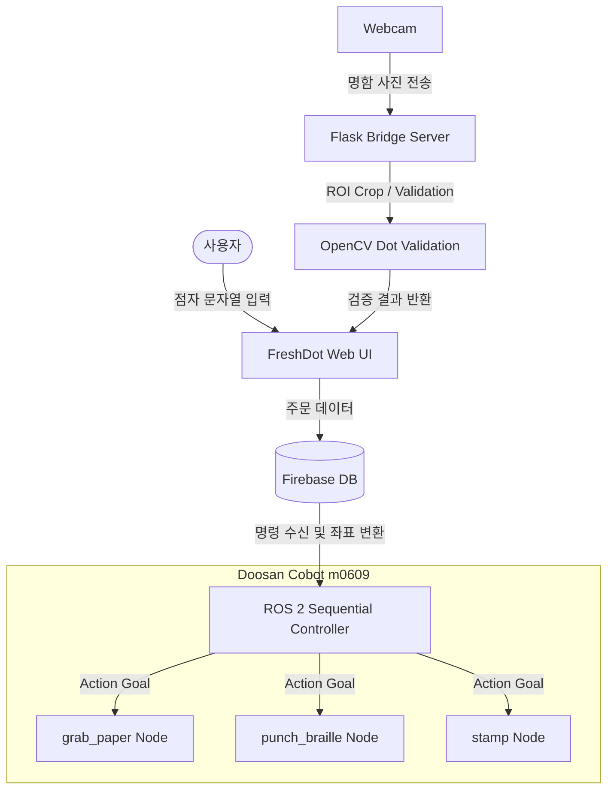

# 🖨️ FreshDot - 협동로봇 기반 점자 명함 제작 시스템
> **Doosan m0609 협동로봇과 OpenCV 웹캠 비전을 융합한 점자 명함 자동화 플랫폼**

---

## 🎥 시연 영상 (Demo Video)
- [원본 고화질 시연 영상 보기/다운로드 (Google Drive)](https://drive.google.com/file/d/1YrUbmCHYf9bIrd3qeIUY499i3NGyc1Ca/view?usp=drive_link)

---

## 📖 1. 프로젝트 개요 (Introduction)
비장애인과 시각장애인이 함께 명함을 주고받을 수 있는 문화를 만들기 위해 기획된 '점자 명함 자동 제작 로봇 시스템'임. 사용자가 웹 UI를 통해 점자로 각인할 문자열을 입력하면, ROS 2 기반 두산 협동로봇(m0609)이 종이 집기, 점자 타각, 잉크 스탬핑 작업을 순차적으로 수행함. 또한, 로봇 작업 후 웹캠과 OpenCV를 이용해 타각된 점자의 품질을 자동으로 검증하는 비전 시스템이 통합되어 있음.

---

## 👥 2. 팀 구성 및 역할 (Team R&R)

본 프로젝트는 Team **FreshDot(rokey-2)**으로 진행됨.

| 이름 | 역할 | 담당 업무 |
| :---: | :---: | :--- |
| **송종진** | 팀장 | **점자 변환 알고리즘 개발 및 타각 로직 구현, 액션을 통한 통합 실행**<br>- `grab_paper`, `punch_braille`, `stamp` ROS 2 액션 클라이언트/서버 로직 통합|
| **김지홍** | 백업 서버 구축 |OpenCV 기반 점자 윤곽선(Contour) 검출 및 한글 점자표 매칭 검증 서버 구축 |
| **김현진** | 프론트엔드 | 사용자 주문용 웹 UI(Vue/React) 제작, 웹캠 브라우저 스트리밍 기능 구현 <br> Firebase Realtime Database 연동 |
| **차송근** | 하드웨어/로봇 | 점자 타각 치구 및 명함 거치대 3D 모델링, 명함 세팅 로직 구현 |
| **민수현** | 로봇 | 도장 찍는 로직 구현|

---

## 🎯 3. 주요 기능 (Key Features)
1. **협동로봇 자동화 파이프라인**: 명함 종이 픽업 ➡️ Firebase 데이터(문자열/좌표) 수신 ➡️ 치구에 맞춰 점자 타각 ➡️ 잉크 스탬핑 ➡️ 마무리 배출까지의 공정을 ROS 2 Action 형태로 순차 제어함.
2. **실시간 데이터 동기화**: 웹 UI에서 입력된 작업 지시가 Firebase Realtime DB를 통해 ROS 2 노드로 즉각 전송됨.
3. **OpenCV 점자 검증**: 완성된 점자 명함을 웹캠으로 촬영 시, Flask 브릿지 서버를 거쳐 영상 처리 알고리즘이 동작함. 점(Dot)을 검출하고 점자 칸(Cell) 단위로 묶은 뒤 의도한 한글 라벨과 비교하여 양불(Pass/Fail)을 판정함.

---

## 📌 4. 시스템 핵심 아키텍처 (Architecture & Pipeline)



---

## 🛠️ 5. 기술 스택 (Tech Stack)

### Software & Frameworks
- **OS**: Ubuntu 22.04 LTS
- **Middleware**: ROS 2 Humble
- **Backend & DB**: Python 3.10, Flask, Firebase Admin SDK
- **Computer Vision**: OpenCV, Numpy

### Hardware
- **Robot Arm**: Doosan Cobot m0609, DRL (Doosan Robot Library)
- **End-Effector**: GripperDA_v1, Tool Weight
- **Sensors/IO**: 웹캠(Webcam), 디지털 I/O (파지 성공 여부 확인 센서)

---

## 💡 6. 트러블슈팅 및 주요 성과 (Troubleshooting & Achievements)

### 1. 명함 그립(Grip) 미스 방지 및 순차 제어 에러 핸들링
* **문제점**: 얇은 명함을 그리퍼가 집을 때 종이가 미끄러지거나 파지에 실패하는 경우가 빈번하여, 이후 점자 타각 공정에서 허공에 작업하는 심각한 논리 오류가 발생함.
* **해결책**:
  - 로봇 제어기 디지털 입력 2번 핀에 연결된 **파지 감지 센서**의 상태를 읽어오는 루프(`get_digital_input(2)`)를 추가함.
  - 종이 파지 여부를 확인한 뒤, 실패 시 ROS 2 Action의 `GRIP_FAIL` 상태 코드를 반환하고 상위 제어기(`braille_sequential_controller`)가 즉각 픽업 재시도 루틴으로 돌아가도록 **강건한 상태 머신(State Machine)**을 설계함.

### 2. 점자 타각 데이터 좌표 동기화
* **문제점**: 웹에서 입력받은 문자를 실제 로봇 물리 좌표(X, Y, Z)로 타각할 때, 문자 길이에 따라 치구 위의 오프셋(Offset)이 누적 오차를 일으켰습니다.
* **해결책**:
  - Firebase에서 받아온 점자 배열을 행렬로 치환하고, 치구 베이스 프레임(`Task Frame`) 기준으로 일정한 간격(X: 6.2mm, Y: 4.1mm 등 점자 표준 규격)을 가산하는 좌표계 캘리브레이션 함수를 구현함.

### 3. OpenCV 뎁스/노이즈 영향 최소화를 통한 점자 인식률 향상
* **문제점**: 웹캠 조명 조건에 따라 점자의 그림자 크기가 달라져, OpenCV Contour 검출 시 점(Dot)이 너무 많이 검출되거나 적게 검출되는 문제가 발생함.
* **해결책**:
  - 사용자 촬영 환경에 대응할 수 있도록 `threshold` 인자(1.3, 0.8 등)를 CLI 레벨에서 동적으로 조정 가능하게 설계함.
  - ROI 원본과 좌우 반전 이미지를 모두 검증해 더 높은 Score를 자동 채택하는 알고리즘(`submatch`)을 적용하여 **최종 점자 검증 정확도(Accuracy)를 95% 이상으로 대폭 상향**시킴.

---

## 🚀 7. 실행 방법 및 환경 구축 (How to Run)

ROS 2 워크스페이스 빌드 후, Launch 파일을 통해 컨트롤러 및 개별 액션 서버를 구동함.

```bash
# 1. ROS 2 및 워크스페이스 Source
source /opt/ros/humble/setup.bash
source ~/cobot_ws/install/setup.bash

# 2. 로봇 제어 통합 Launch 실행
ros2 launch cobot1 total2.launch.py

# 3. 비전 점자 검증 Flask 서버 실행 (별도 터미널)
cd ~/cobot_ws/src/freshdot_ws
python3 opencv_bridge_server_image_roi_debug_save_submatch.py
```
