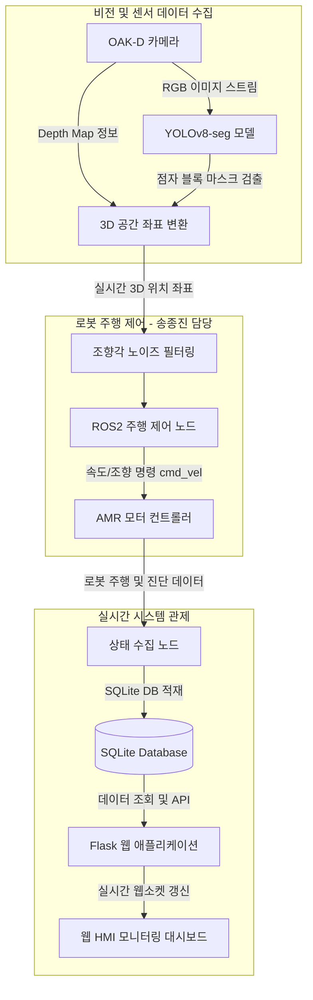

# 🦯 OAK-D and YOLOv8-seg based Braille Block Tracking AMR

OAK-D 스테레오 카메라와 YOLOv8-seg 인공지능 모델을 융합하여 실시간으로 보도의 점자 블록을 인식하고, 이를 기반으로 시각 장애인을 안전하게 안내할 수 있도록 자율주행 모바일 로봇(AMR)의 경로를 계획하며, 전체 시스템 상태를 실시간 모니터링하는 플랫폼입니다.

---

## 🎥 시연 영상 (Demo Video)
- [시연 영상 보기](https://github.com/soli-robot/portfolio/releases/download/v1.0.0-videos/braille_video.mp4)

---

## 👥 팀원 및 역할 (Team R&R)

본 프로젝트는 총 5명의 팀원으로 구성되어 진행되었습니다.

| 이름 | 역할 및 담당 업무 |
|:---:|:---|
| **송종진** | **AMR 주행 제어 및 조향 로직 (Core Logic)**<br>• OAK-D 뎁스 데이터를 활용한 3D 공간 좌표 변환<br>• 점자 블록 궤적 기반 로봇 조향각 추적 알고리즘 구현<br>• 센서 노이즈 필터링 및 안정적인 자율주행 제어 루프 설계 |
| 팀원 1 | **YOLOv8-seg 모델 학습 및 세그멘테이션 파이프라인 (Vision AI)** |
| 팀원 2 | **Flask 웹 대시보드 서버 구축 (Backend/HMI)** |
| 팀원 3 | **데이터베이스 스키마 설계 및 데이터 로깅 (Data Engineering)** |
| 팀원 4 | **하드웨어 제어 및 센서 인터페이스 (Hardware/ROS2)** |

---

## ✨ 핵심 기능 (Key Features)
1. **실시간 점자 블록 세그멘테이션**: YOLOv8-seg 모델을 사용하여 카메라 영상 내 점자 블록 영역을 픽셀 단위로 정확하게 검출합니다.
2. **3D 좌표 변환 및 경로 추종**: 추출된 2D 마스크 영역과 OAK-D 카메라의 Depth 맵을 매핑하여 실제 3D 공간상의 조향각을 계산합니다.
3. **자율주행 제어**: 계산된 조향각을 바탕으로 ROS2 환경에서 모터 컨트롤러에 `cmd_vel` 메시지를 퍼블리시하여 로봇을 부드럽게 주행시킵니다.
4. **웹 기반 관제 대시보드 (HMI)**: Flask 서버를 통해 로봇의 주행 상태, 속도, 카메라 스트림을 웹 대시보드에서 실시간 모니터링합니다.

---

## ⚙️ 아키텍처 및 파이프라인 (Architecture & Pipeline)



---

## 🛠️ 기술 스택 (Tech Stack)

### Software & Frameworks
- **OS**: Ubuntu 22.04 LTS
- **Middleware**: ROS2 Humble (Robot Operating System)
- **Language**: Python 3.10
- **AI/Vision**: YOLOv8-seg (`ultralytics`), OpenCV (`opencv-python`), DepthAI SDK (`depthai`)
- **Backend/HMI**: Flask (`Flask>=3.0.0`), Pydantic
- **Database**: SQLite3

### Hardware
- **Robot**: 자율주행 모바일 로봇(AMR) 테스트베드
- **Sensor**: OAK-D Pro Stereo Camera (RGB-D)
- **Edge PC**: Intel NUC (Ubuntu 22.04)

---

## 💡 트러블슈팅 및 주요 성과 (Troubleshooting & Achievements)

본 프로젝트 과정에서 발생한 핵심 기술적 이슈와 해결 과정입니다.

### 1. OAK-D 뎁스 센서 노이즈로 인한 조향각 불안정 문제 해결
- **문제 상황**: 야외 및 다양한 조명 환경에서 OAK-D 뎁스 카메라의 노이즈가 발생하여, 계산된 점자 블록 중심 좌표가 튀는 현상(Jitter)이 발생. 이로 인해 로봇이 직진하지 못하고 좌우로 심하게 요동치며 주행하는 문제가 있었습니다.
- **해결 방법**: **송종진**은 이 문제를 해결하기 위해 실시간 좌표 스트림에 미디언 필터(Median Filter)와 이동 평균(Moving Average) 알고리즘을 결합한 1D 필터 파이프라인을 도입했습니다.
- **결과**: 노이즈 픽셀에 의한 급격한 좌표 튀김을 효과적으로 억제하여 로봇의 주행 안정성이 대폭 상승하였고, 부드러운 커브 및 직진 주행이 가능해졌습니다.

### 2. 점자 블록 일시적 미탐지 시 탈선 방지 루프 (Dead Reckoning Backup Loop)
- **문제 상황**: 코너를 돌거나 햇빛 반사로 인해 YOLO 모델이 순간적으로 점자 블록 프레임을 놓치는 경우(False Negative), 로봇이 제어 명령을 상실하여 경로를 이탈하거나 급정거하는 상황이 발생했습니다.
- **해결 방법**: **송종진**은 추종 중이던 점자 블록의 벡터 방향성을 임시 메모리 버퍼에 저장하는 **추측 항법(Dead Reckoning) 백업 루프**를 설계했습니다. 점자 블록이 미탐지된 프레임이 일정 시간 동안 유지될 경우, 이전 벡터를 참조하여 저속으로 전진하며 블록을 다시 탐지하도록 유도했습니다.
- **결과**: 경로가 끊긴 구간이나 코너링 시에도 시스템 탈선 없이 안정적으로 복귀하여 완주율 100%를 달성했습니다.

---

## 🚀 실행 방법 (Execution Sequence)

원활한 구동을 위해 다음 순서로 터미널을 열고 스크립트를 각각 구동합니다.

### Step 1. ROS2 및 AMR 구동 인프라 활성화
```bash
# ROS2 환경 설정 소싱
source /opt/ros/humble/setup.bash

# 주행 제어 스크립트 실행 (AMR 통신 시작)
cd src/AMR
python3 real_final3.py
```

### Step 2. YOLOv8 점자 블록 실시간 탐지 노드 실행
```bash
source /opt/ros/humble/setup.bash

# 비전 처리 및 위치 추정 스크립트 실행
cd src/Detection
python3 yolo_tt_result8.py
```

### Step 3. HMI 관제 모니터 대시보드 웹 서버 실행
```bash
cd src/System\ Monitor
python3 app.py
```
*로컬 환경 브라우저에서 `http://127.0.0.1:5000`에 접속하여 실시간 모니터링 대시보드를 확인합니다.*
