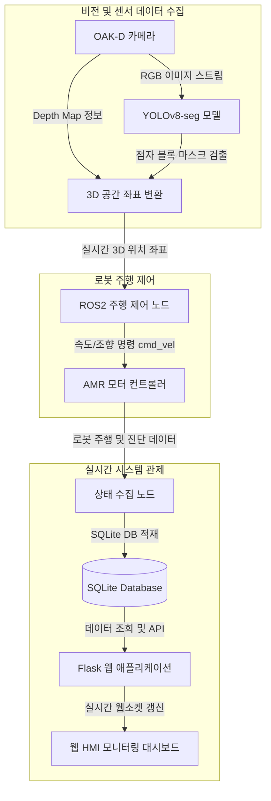

# 🦯 시각 장애인 안내용 자율주행 AMR 및 시스템 관제

OAK-D 스테레오 카메라와 YOLOv8-seg 인공지능 모델을 융합하여 실시간으로 보도의 점자 블록을 인식하고, 이를 기반으로 시각 장애인을 안전하게 안내할 수 있도록 자율주행 모바일 로봇(AMR)의 경로를 계획하며, 전체 시스템 상태를 실시간 모니터링하는 플랫폼입니다.

---

## 🎥 시연 영상 (Demo Video)
- [시연 영상 보기 (Google Drive)](https://drive.google.com/file/d/your-braille-video-id/view?usp=sharing)
  > [!TIP]
  > 대용량 파일 업로드 제한으로 인해 고화질 시연 영상은 Google Drive 공유 링크를 통해 제공됩니다.

---

## 📊 1. 시스템 설계 및 플로우 차트 (System Design & Flow Chart)

### 시스템 개요
본 시스템은 크게 3가지 컴포넌트로 구성됩니다:
1. **비전 처리 (Vision Processing)**: OAK-D 카메라의 RGB-D 데이터를 받아 YOLOv8-seg 모델로 점자 블록을 실시간 세그멘테이션하고 3D 공간 상의 좌표로 변환합니다.
2. **로봇 제어 (Control Logic)**: 추출된 3D 좌표를 바탕으로 ROS2 주행 제어 노드가 조향각과 속도(`cmd_vel`)를 계산하여 AMR 모터 컨트롤러에 전송합니다.
3. **시스템 관제 (Monitoring)**: 로봇의 동작 상태 정보를 실시간으로 SQLite DB에 저장하고, Flask HMI 대시보드를 통해 주행 상태 및 오류 경보를 실시간 모니터링합니다.

### 시스템 흐름도 (Mermaid)



---

## 💻 2. 운영체제 환경 (Operating System Environment)

- **OS**: Ubuntu 22.04 LTS
- **Middleware**: ROS2 Humble (Robot Operating System)
- **개발 환경**: Python 3.10

---

## 🛠️ 3. 사용한 장비 목록 (Hardware Equipment List)

- **로봇 플랫폼**: 자율주행 모바일 로봇(AMR) 테스트베드
- **비전 센서**: OAK-D Pro Stereo Camera (RGB-D 지원)
- **온보드 PC (Edge Computer)**: Intel NUC 혹은 동급 싱글 보드 컴퓨터 (Ubuntu 22.04 설치)

---

## 📦 4. 의존성 (Dependencies)

프로젝트에 필수적인 파이썬 의존성은 다음과 같으며, `requirements.txt`에 명시되어 있습니다.

- **컴퓨터 비전 & AI**: `ultralytics` (YOLOv8-seg), `opencv-python`, `depthai` (DepthAI SDK)
- **백엔드 HMI 및 대시보드**: `Flask>=3.0.0`, `pydantic`
- **데이터베이스**: `sqlite3` (Python 내장 라이브러리)
- **로봇 미들웨어 (시스템 패키지 설치 필요)**: `rclpy`, `sensor_msgs`, `geometry_msgs`

> [!NOTE]
> 자세한 내용은 [requirements.txt](requirements.txt) 파일을 참고해 주세요.

---

## 🚀 5. 간단한 실행 순서 (Execution Sequence & Launch Script)

원활한 구동을 위해 다음 순서로 터미널을 열고 스크립트를 각각 구동합니다.

### Step 1. ROS2 및 AMR 구동 인프라 활성화
AMR 로봇의 구동 노드 및 모터 드라이버 통신을 시작합니다.
```bash
# ROS2 환경 설정 소싱
source /opt/ros/humble/setup.bash

# 주행 제어 스크립트 실행
cd src/AMR
python3 real_final3.py
```

### Step 2. YOLOv8 점자 블록 실시간 탐지 노드 실행
카메라 RGB-D 입력을 받아 주행 경로 기준선인 점자 블록을 탐지합니다.
```bash
source /opt/ros/humble/setup.bash

# YOLOv8-seg 탐지 스크립트 실행
cd src/Detection
python3 yolo_tt_result8.py
```

### Step 3. HMI 관제 모니터 대시보드 웹 서버 실행
로봇의 운행 정보와 카메라 실시간 스트림 화면을 시각화하는 모니터링 대시보드 서버를 켭니다.
```bash
cd src/System\ Monitor
python3 app.py
```
*로컬 환경 브라우저에서 `http://127.0.0.1:5000`에 접속하여 실시간 웹 대시보드로 운행 상태를 관제합니다.*
