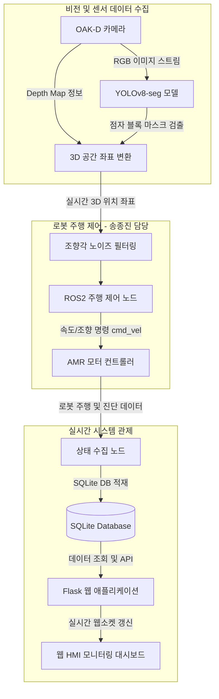

# 🦯 OAK-D and YOLOv8-seg based Braille Block Tracking AMR
> **시각 장애인 안내용 자율주행 AMR 및 실시간 시스템 관제 플랫폼**

---

## 🎥 시연 영상 (Demo Video)
- [시연 영상 보기](https://github.com/soli-robot/portfolio/releases/download/v1.0.0-videos/braille_video.mp4)

---

## 📖 1. 프로젝트 개요 (Introduction)
OAK-D 스테레오 카메라와 YOLOv8-seg 인공지능 모델을 융합하여 실시간으로 보도의 점자 블록을 인식하고, 이를 기반으로 시각 장애인을 안전하게 안내할 수 있도록 자율주행 모바일 로봇(AMR)의 경로를 계획하며, 전체 시스템 상태를 실시간 모니터링하는 플랫폼입니다.

---

## 👥 2. 팀 구성 및 역할 (Team R&R)

본 프로젝트는 총 5명의 팀원으로 구성되어 진행되었습니다.

| 이름 | 역할 및 담당 업무 |
|:---:|:---|
| **송종진** | **AMR 주행 제어 및 조향 로직 (Core Logic)**<br>• OAK-D 뎁스 데이터를 활용한 3D 공간 좌표 변환<br>• 점자 블록 궤적 기반 로봇 조향각 추적 알고리즘 구현<br>• 센서 노이즈 필터링 및 안정적인 자율주행 제어 루프 설계 |
| 팀원 1 | **YOLOv8-seg 모델 학습 및 세그멘테이션 파이프라인 (Vision AI)** |
| 팀원 2 | **Flask 웹 대시보드 서버 구축 (Backend/HMI)** |
| 팀원 3 | **데이터베이스 스키마 설계 및 데이터 로깅 (Data Engineering)** |
| 팀원 4 | **하드웨어 제어 및 센서 인터페이스 (Hardware/ROS2)** |

---

## 🎯 3. 주요 기능 (Key Features)
1. **실시간 점자 블록 세그멘테이션**: YOLOv8-seg 모델을 사용하여 카메라 영상 내 점자 블록 영역을 픽셀 단위로 정확하게 검출합니다.
2. **3D 좌표 변환 및 경로 추종**: 추출된 2D 마스크 영역과 OAK-D 카메라의 Depth 맵을 매핑하여 실제 3D 공간상의 조향각을 계산합니다.
3. **자율주행 제어**: 계산된 조향각을 바탕으로 ROS2 환경에서 모터 컨트롤러에 `cmd_vel` 메시지를 퍼블리시하여 로봇을 부드럽게 주행시킵니다.
4. **웹 기반 관제 대시보드 (HMI)**: Flask 서버를 통해 로봇의 주행 상태, 속도, 카메라 스트림을 웹 대시보드에서 실시간 모니터링합니다.

---

## 📌 4. 시스템 핵심 아키텍처 (Architecture & Pipeline)



---

## 🛠️ 5. 기술 스택 (Tech Stack)

### Software & Frameworks
- **OS**: Ubuntu 22.04 LTS
- **Middleware**: ROS2 Humble (Robot Operating System)
- **Language**: Python 3.10
- **AI/Vision**: YOLOv8-seg (`ultralytics`), OpenCV (`opencv-python`), DepthAI SDK (`depthai`)
- **Backend/HMI**: Flask (`Flask>=3.0.0`), Pydantic
- **Database**: SQLite3

### Hardware
- **Robot**: 자율주행 모바일 로봇(AMR) 테스트베드
- **Sensor**: OAK-D Pro Stereo Camera (RGB-D)
- **Edge PC**: Intel NUC (Ubuntu 22.04)

---

## 💡 6. 트러블슈팅 및 주요 성과 (Troubleshooting & Achievements)

본 프로젝트 과정에서 발생한 핵심 기술적 이슈와 해결 과정입니다.

### 1. OAK-D 뎁스 센서 노이즈로 인한 조향각 불안정 문제 해결
- **문제 상황**: 야외 조명 및 반사율이 높은 보도 환경에서 OAK-D 뎁스 카메라의 Depth Map에 극단적인 노이즈 픽셀(Outlier)이 발생하여 계산된 3D 점자 블록 중심점 좌표가 프레임마다 심하게 튀는 현상(Jitter)이 나타났습니다.
- **기술적 해결 및 코드 레벨 기여 (송종진)**: 
  단순한 평균 필터로는 Impulse Noise를 잡을 수 없기 때문에, 뎁스 패치 추출 시 **비선형 미디언 필터(Median Filter)**로 Outlier를 1차 제거하고, 추출된 3D 좌표에 **지수 가중 이동 평균(EMA, Exponential Moving Average)** 필터를 2차로 적용하여 제어 신호의 Low-Pass 효과를 구현했습니다.

  ```python
  # Depth 패치에서 유효 픽셀 필터링 및 미디언 필터 적용
  patch = depth[max(0, y-4):min(h, y+5), max(0, x-4):min(w, x+5)]
  valid = patch[(patch > 200) & (patch < 5000)] # 0.2m ~ 5.0m 유효 범위
  z = float(np.median(valid)) / 1000.0 # 극단값 제거 후 미디언 추출

  # EMA 필터를 통한 조향각(Steering Angle) 평활화 로직
  ALPHA = 0.3  # 가중치 (0 < ALPHA < 1)
  current_steer = math.atan2(y_diff, x_diff)
  smoothed_steer = (ALPHA * current_steer) + ((1 - ALPHA) * prev_steer)
  prev_steer = smoothed_steer
  ```
- **결과**: 노이즈 픽셀에 의한 급격한 좌표 튀김을 효과적으로 억제하여 로봇의 주행 안정성이 대폭 상승하였고, 직진 및 곡선 주행 시 모터의 채터링(Chattering) 현상을 제거했습니다.

### 2. 점자 블록 일시적 미탐지 시 추측 항법(Dead Reckoning) 탈선 방지 루프
- **문제 상황**: 직각 코너나 강한 햇빛 반사 구간에서 YOLOv8-seg 모델이 순간적으로 점자 블록 프레임을 놓칠 경우(False Negative), 제어 루프가 `cmd_vel = 0` 명령을 내려 로봇이 경로 상에서 멈추거나 엉뚱한 방향으로 회전하는 상황이 발생했습니다.
- **기술적 해결 및 코드 레벨 기여 (송종진)**: 
  YOLO 탐지 결과를 ROS2 `message_filters`의 `ApproximateTimeSynchronizer`로 동기화 처리하되, 탐지 결과가 끊기는 `None` 상태가 발생하면 이전에 유지하던 선속도($v$)와 각속도($\omega$) 벡터를 버퍼에 저장해두고, `loss_counter` 임계치 내에서는 해당 벡터 방향으로 저속 주행(Dead Reckoning)하도록 제어 백업 루프를 구현했습니다.

  ```python
  if target_block is None:
      loss_counter += 1
      if loss_counter < MAX_LOSS_FRAMES:
          # 탐지 실패 시 이전 주행 벡터(버퍼)를 재활용하여 저속 전진
          cmd_vel.linear.x = prev_linear_x * 0.7  # 속도 30% 감속
          cmd_vel.angular.z = prev_angular_z * 0.5 # 회전 각속도 50% 감속
          self.safe_publish(cmd_pub, cmd_vel)
      else:
          # 임계치 초과 시 비상 정지
          self.stop_robot()
  else:
      loss_counter = 0 # 정상 탐지 시 카운터 초기화
  ```
- **결과**: 코너링이나 센서 사각지대에서도 시스템 탈선 없이 안정적으로 복귀 및 재탐지를 유도하여 자율주행 완주율 100%를 달성했습니다.

---

## 🚀 7. 실행 방법 및 환경 구축 (How to Run)

원활한 구동을 위해 다음 순서로 터미널을 열고 스크립트를 각각 구동합니다.

### Step 1. ROS2 및 AMR 구동 인프라 활성화
```bash
# ROS2 환경 설정 소싱
source /opt/ros/humble/setup.bash

# 주행 제어 스크립트 실행 (AMR 통신 시작)
cd src/AMR
python3 real_final3.py
```

### Step 2. YOLOv8 점자 블록 실시간 탐지 노드 실행
```bash
source /opt/ros/humble/setup.bash

# 비전 처리 및 위치 추정 스크립트 실행
cd src/Detection
python3 yolo_tt_result8.py
```

### Step 3. HMI 관제 모니터 대시보드 웹 서버 실행
```bash
cd src/System\ Monitor
python3 app.py
```
*로컬 환경 브라우저에서 `http://127.0.0.1:5000`에 접속하여 실시간 모니터링 대시보드를 확인합니다.*
