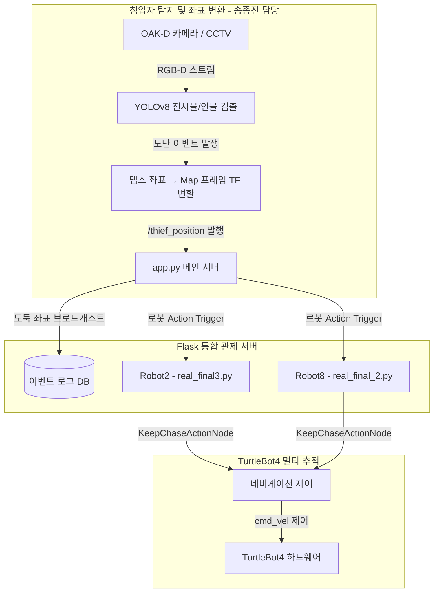
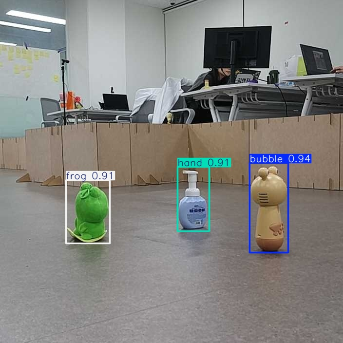
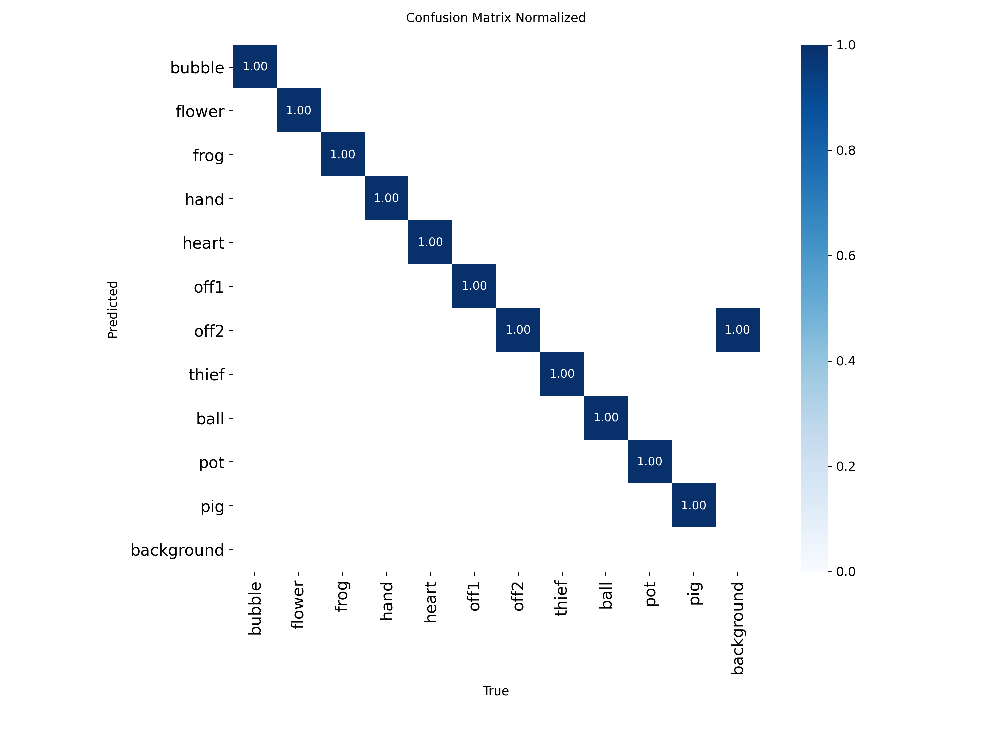
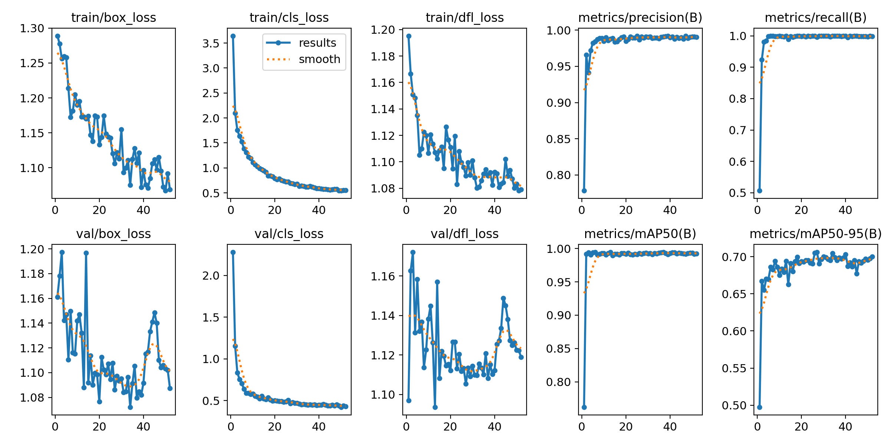
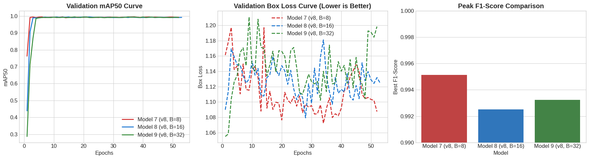

# 🚨 Museum is Alive - 박물관 보안 관제 및 로봇 다중 추적 시스템
> **다중 로봇 보안 관제 및 침입자 탐지 시스템**

---

## 🎥 시연 영상 (Demo Video)
- [원본 고화질 시연 영상 보기/다운로드 (Google Drive)](https://drive.google.com/file/d/1oryZ9hMTa0bOIzXSIaYiXXN45wTbtwfL/view?usp=drive_link)

---

## 📖 1. 프로젝트 개요 (Introduction)
다중 CCTV 카메라 입력 스트림을 인공지능 기반으로 실시간 모니터링하여 비인가 구역에 진입하거나 전시물을 손대려는 침입자(도둑)를 정밀하게 식별하고, 중앙 관제 서버(Flask)와 ROS2 멀티 로봇이 연계하여 침입자를 자율 추적 및 포위하는 지능형 보안 관제 시스템입니다.

---

## 👥 2. 팀 구성 및 역할 (Team R&R)

본 프로젝트는 "박물관이 살아있다 (Museum is Alive)"라는 테마로 진행되었으며, 각 파트별 역할은 다음과 같습니다.

| 이름 | 역할 및 담당 업무 |
|:---:|:---|
| **송종진** | **비전 객체 탐지 및 TF 좌표 변환 (Detection & Vision AI)**<br>• YOLOv8 기반 전시물 도난 및 침입자 인식 로직 구현<br>• OAK-D 카메라 뎁스 픽셀값을 월드 좌표계로 변환 (TF Translation)<br>• 도둑의 위치를 계산하여 `/robotX/thief_position` PointStamped 토픽으로 발행 |
| 팀원 1 | **멀티 로봇 자율주행 및 추적 알고리즘 구현 (AMR Control)** |
| 팀원 2 | **Flask 기반 중앙 통합 관제 서버 개발 (Backend/Server)** |
| 팀원 3 | **YOLO 모델 파인튜닝 및 데이터 수집 (AI Modeling)** |
| 팀원 4 | **멀티 로봇 분산 통신(ROS2) 및 하드웨어 연동 (ROS2/Hardware)** |

---

## 🎯 3. 주요 기능 (Key Features)
1. **YOLO 기반 전시물 및 침입자 동시 모니터링**: 딥러닝 모델이 전시물의 도난 여부와 침입자의 위치를 실시간 프레임에서 동시에 판별합니다.
2. **다중 로봇 협동 추적 (Multi-Robot Pursuit)**: 도난 이벤트 발생 시, 중앙 관제 서버가 2대의 TurtleBot4(AMR)를 깨워 도둑의 좌표를 기반으로 추적 및 양방향 포위 기동을 수행합니다.
3. **TF 프레임 변환**: OAK-D 카메라의 로컬 좌표를 ROS2 `tf2`를 이용해 월드 맵 좌표로 치환하여 로봇 네비게이터에게 전달합니다.
4. **Flask 통합 관제 대시보드**: 현장 카메라 스트림과 로봇들의 배터리 상태, 현재 위치, 추적 진행도를 웹에서 실시간 모니터링하고 원격 제어합니다.

---

## 📌 4. 시스템 핵심 아키텍처 (Architecture & Pipeline)



---

## 🛠️ 5. 기술 스택 (Tech Stack)

### Software & Frameworks
- **OS**: Ubuntu 22.04 LTS
- **Middleware**: ROS2 Humble (Robot Operating System), Nav2
- **Language**: Python 3.10
- **AI/Vision**: YOLOv8 (`ultralytics`), OpenCV (`opencv-python`)
- **Backend/Server**: Flask (`Flask>=3.0.0`)

### Hardware
- **Robot**: TurtleBot4 다중 로봇 시스템 (robot2, robot8)
- **Sensor**: OAK-D Pro Stereo Camera, RPLIDAR
- **Edge PC**: NVIDIA Jetson / Raspberry Pi 4

---

## 💡 6. 트러블슈팅 및 주요 성과 (Troubleshooting & Achievements)

멀티 로봇 협동 제어 및 비전 인식 과정에서 발생한 핵심 문제를 다음과 같이 해결했습니다.

### 1. Depth 픽셀 필터링 및 TF 좌표 변환 최적화를 통한 추적 안정성 확보 (송종진 담당)
- **문제 상황**: 로봇 주행 중 진동으로 인해 OAK-D 카메라의 뎁스 데이터가 요동치며, 계산된 도둑의 `PointStamped` 좌표(`/thief_position`)가 불안정하게 퍼블리시되는 현상 발생. 이로 인해 Nav2 플래너가 계속 경로를 재탐색(Re-planning)하며 로봇이 제자리 회전하는 문제가 있었습니다.
- **기술적 해결 및 코드 레벨 기여 (송종진)**: 
  Depth 패치의 극단값을 걸러내는 미디언 필터 적용과 더불어, ROS2 `tf2_ros.Buffer`를 활용하여 카메라 좌표계(frame_id)에서 맵 좌표계('map')로의 TF 변환 시 동기화 및 타임아웃 예외 처리를 정교하게 구성했습니다. 또한 `pose_hold_time`을 적용해 타겟이 일시적으로 사라져도 이전 유효 좌표를 유지하도록 구현했습니다.

  ```python
  # 1. Depth 패치 노이즈 필터링 (Valid z-값 추출)
  valid = patch[(patch > 200) & (patch < 5000)]
  z = float(np.median(valid)) / 1000.0 # 튀는 픽셀 제거를 위한 Median 처리

  # 2. Camera -> Map 좌표계 실시간 TF 변환 및 예외 처리
  try:
      tf_time = Time.from_msg(depth_stamp_msg)
      transform = self.tf_buffer.lookup_transform(
          'map', frame_id, tf_time, timeout=Duration(seconds=1.5)
      )
      return do_transform_point(pt_camera, transform)
  except Exception as e:
      # Timestamp 동기화 실패 시 Fallback 로직 
      transform = self.tf_buffer.lookup_transform(
          'map', frame_id, Time(), timeout=Duration(seconds=1.5)
      )
      return do_transform_point(pt_camera, transform)
  ```
- **결과**: 추적 로봇의 주행이 덜컹거리지 않고 부드러운 Pursuit Curve를 그리며 도둑을 안정적으로 추적할 수 있었습니다.

### 2. 다중 로봇 간 충돌 방지 (Deadlock) 및 상호 배타적 인터락(Interlock) 제어
- **문제 상황**: 2대의 로봇(Robot2, Robot8)이 동일한 도둑의 위치 토픽을 수신해 좁은 복도에서 동시 추적을 진행할 때, 먼저 타겟에 도달하려다 서로 충돌하거나 장애물로 인식해 멈춰버리는(Deadlock) 현상이 발생했습니다.
- **기술적 해결 및 코드 레벨 기여 (송종진)**: 
  비전 노드 단에서 ROS2 `std_msgs/Bool` 타입의 토픽(`/robot8/catch_thief_8`)을 구독(Subscribe)하여 상호 배타적인 **Interlock 상태 머신**을 설계했습니다. 상대 로봇이 이미 도둑 좌표를 산출 및 포위 중이면 내 쪽의 좌표 퍼블리시를 생략하고, 추적 Action 노드 단에서는 타겟 반경 `0.8m` 내 진입 시 Nav2 Goal 갱신을 멈추는 포위 대기 거리를 수학적으로 계산했습니다.

  ```python
  # [Vision Node] 멀티 로봇 동선 겹침 방지 (Interlock)
  if self.catch_thief_8:
      self.safe_warn("⛔ robot8이 먼저 도둑 추적 중 → 우리 쪽 좌표 계산 중단")
      continue # 타겟 좌표 계산 생략 (교착 방지)
  else:
      self.safe_publish(self.catch_thief_2_pub, Bool(data=True)) # 선점 선언

  # [Action Node] 타겟 반경 도달 시 포위 대기 (거리 기반 정지)
  dx = tx - rx
  dy = ty - ry
  dist = math.hypot(dx, dy)

  if dist <= CHASE_DISTANCE_M:  # CHASE_DISTANCE_M = 0.8m
      self.get_logger().info(f'도둑 {CHASE_DISTANCE_M}m 이내. goal 갱신 중지')
      return # 더 이상 접근하지 않고 포위 유지
  
  # 일정한 거리를 두고 추적할 수 있도록 유닛 벡터 기반 Goal 계산
  ux, uy = dx / dist, dy / dist
  goal_x = tx - ux * CHASE_DISTANCE_M
  goal_y = ty - uy * CHASE_DISTANCE_M
  ```
- **결과**: 좁은 공간에서도 다중 로봇이 충돌 없이 역할을 분담하여 서로 거리를 유지한 채 도둑을 양쪽에서 포위하는 안정적인 협동 시나리오를 완성했습니다.

### 3. 실시간 관제를 위한 최적의 YOLO 아키텍처 발굴 및 선정
- **문제 상황**: 다중 로봇이 실시간으로 침입자를 쫓기 위해서는 비전 모델의 정확도(미탐 방지)뿐만 아니라 초당 프레임(FPS) 처리가 병목이 되지 않아야 하며, 타이트한 바운딩 박스를 통해 정확한 좌표 변환이 필요했습니다.
- **기술적 해결 및 모델 실험 (송종진)**: 
  YOLO 아키텍처(v8, v10, v26)와 Batch Size(8, 16, 32)를 교차 조합하여 **총 9개의 시나리오**로 객체 탐지 모델 실험 평가를 진행했습니다. mAP50, F1-Score, F1-Confidence, Inference Time, Box Loss 등의 지표를 입체적으로 분석했습니다.
- **결과 (Model 7 선정)**: 실험 결과, **YOLOv8 / Batch 8 (Model 7)** 모델을 최종 배포용으로 선정했습니다.
  - **최고 정확도 및 안정성**: 전체 1위의 mAP50(`0.9944`) 및 완벽에 가까운 최고 F1-Score(`0.9951`)를 달성해 미탐을 최소화했습니다.
  - **정교한 위치 추정**: Box Loss가 `1.079`로 가장 낮아 객체에 빈틈없이 타이트한 Bounding Box를 생성하여 정확한 중심 픽셀 뎁스 추출이 가능했습니다.
  - **실시간 처리**: 추론 속도 `10.30ms` (약 97 FPS)로 다중 로봇 관제에 전혀 병목이 없는 실시간성을 검증했습니다.

#### 🔍 최적 모델 (Model 7) 시각화 결과
<div align="center">
  
  
  
</div>

#### 📊 최상위 3개 모델 비교 분석 차트 (Model 7 vs 8 vs 9)
<div align="center">
  
</div>

---

## 🚀 7. 실행 방법 및 환경 구축 (How to Run)

보안 관제 프로그램 및 모터 추적 노드를 구동하는 명령어 구성입니다.

### Step 1. 통합 관제 Flask 서버 실행
```bash
cd src/System\ Monitor
python3 app.py
```

### Step 2. 침입자 탐지 노드 및 좌표 변환 퍼블리셔 구동 (송종진 담당)
```bash
source /opt/ros/humble/setup.bash
# YOLO 탐지 및 TF 변환 스크립트 실행
python3 main_detector.py
```

### Step 3. 멀티 로봇 자율주행 및 추적 노드 구동
각 로봇의 네임스페이스에 맞게 추적 스크립트를 독립적으로 실행합니다.
```bash
source /opt/ros/humble/setup.bash
# 첫 번째 로봇 (Robot2) 구동
python3 real_final3.py

# 두 번째 로봇 (Robot8) 구동
python3 real_final_2.py
```
