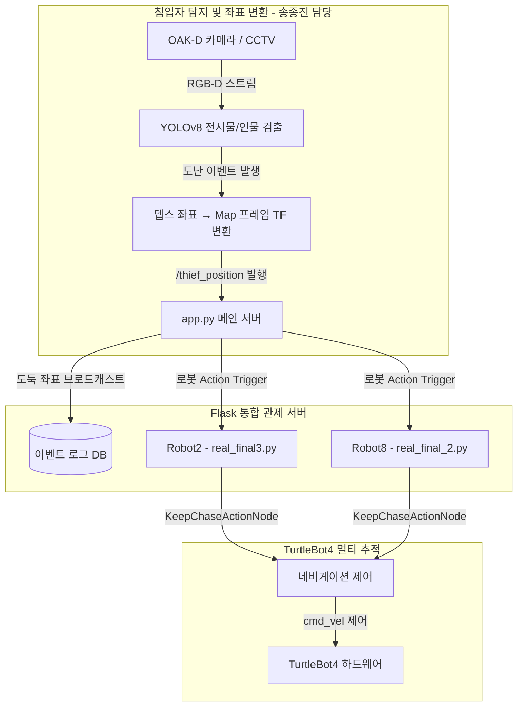

# 🚨 박물관 보안 관제 및 로봇 다중 추적 시스템 (박살팀 - Museum is Alive)

다중 CCTV 카메라 입력 스트림을 인공지능 기반으로 실시간 모니터링하여 비인가 구역에 진입하거나 전시물을 손대려는 침입자(도둑)를 정밀하게 식별하고, 중앙 관제 서버(Flask)와 ROS2 멀티 로봇이 연계하여 침입자를 자율 추적 및 포위하는 지능형 보안 관제 시스템입니다.

---

## 🎥 시연 영상 (Demo Video)
- [시연 영상 보기](https://github.com/soli-robot/portfolio/releases/download/v1.0.0-videos/find_thief_video.mp4)

---

## 👥 팀원 및 역할 (Team R&R)

본 프로젝트는 "박물관이 살아있다 (Museum is Alive)"라는 테마로 진행되었으며, 각 파트별 역할은 다음과 같습니다.

| 이름 | 역할 및 담당 업무 |
|:---:|:---|
| **송종진** | **비전 객체 탐지 및 TF 좌표 변환 (Detection & Vision AI)**<br>• YOLOv8 기반 전시물 도난 및 침입자 인식 로직 구현<br>• OAK-D 카메라 뎁스 픽셀값을 월드 좌표계로 변환 (TF Translation)<br>• 도둑의 위치를 계산하여 `/robotX/thief_position` PointStamped 토픽으로 발행 |
| 팀원 1 | **멀티 로봇 자율주행 및 추적 알고리즘 구현 (AMR Control)** |
| 팀원 2 | **Flask 기반 중앙 통합 관제 서버 개발 (Backend/Server)** |
| 팀원 3 | **YOLO 모델 파인튜닝 및 데이터 수집 (AI Modeling)** |
| 팀원 4 | **멀티 로봇 분산 통신(ROS2) 및 하드웨어 연동 (ROS2/Hardware)** |

---

## ✨ 핵심 기능 (Key Features)
1. **YOLO 기반 전시물 및 침입자 동시 모니터링**: 딥러닝 모델이 전시물의 도난 여부와 침입자의 위치를 실시간 프레임에서 동시에 판별합니다.
2. **다중 로봇 협동 추적 (Multi-Robot Pursuit)**: 도난 이벤트 발생 시, 중앙 관제 서버가 2대의 TurtleBot4(AMR)를 깨워 도둑의 좌표를 기반으로 추적 및 양방향 포위 기동을 수행합니다.
3. **TF 프레임 변환**: OAK-D 카메라의 로컬 좌표를 ROS2 `tf2`를 이용해 월드 맵 좌표로 치환하여 로봇 네비게이터에게 전달합니다.
4. **Flask 통합 관제 대시보드**: 현장 카메라 스트림과 로봇들의 배터리 상태, 현재 위치, 추적 진행도를 웹에서 실시간 모니터링하고 원격 제어합니다.

---

## ⚙️ 아키텍처 및 파이프라인 (Architecture & Pipeline)



---

## 🛠️ 기술 스택 (Tech Stack)

### Software & Frameworks
- **OS**: Ubuntu 22.04 LTS
- **Middleware**: ROS2 Humble (Robot Operating System), Nav2
- **Language**: Python 3.10
- **AI/Vision**: YOLOv8 (`ultralytics`), OpenCV (`opencv-python`)
- **Backend/Server**: Flask (`Flask>=3.0.0`)

### Hardware
- **Robot**: TurtleBot4 다중 로봇 시스템 (robot2, robot8)
- **Sensor**: OAK-D Pro Stereo Camera, RPLIDAR
- **Edge PC**: NVIDIA Jetson / Raspberry Pi 4

---

## 💡 트러블슈팅 및 주요 성과 (Troubleshooting & Achievements)

멀티 로봇 협동 제어 및 비전 인식 과정에서 발생한 핵심 문제를 다음과 같이 해결했습니다.

### 1. 칼만 필터(Kalman Filter)를 통한 타겟 좌표 흔들림 방지 (송종진 담당)
- **문제 상황**: 로봇이 이동 중일 때 OAK-D 카메라의 뎁스 데이터가 크게 흔들려 도둑의 PointStamped 좌표(`/thief_position`)가 불안정하게 퍼블리시되는 현상이 발생. 이로 인해 추적 로봇의 Nav2 플래너가 경로를 계속 재탐색하며 제자리에서 회전하는 문제가 있었습니다.
- **해결 방법**: **송종진**은 검출된 위치 좌표에 칼만 필터를 적용하여 노이즈를 평활화(Smoothing)하고, `pose_hold_time = 2.0s` 파라미터를 추가하여 도둑이 잠시 시야에서 사라지더라도 마지막 위치를 2초간 유지하여 안정적인 추적 벡터를 생성하도록 설계했습니다.
- **결과**: 추적 로봇의 주행이 덜컹거리지 않고 부드러운 Pursuit Curve를 그리며 도둑을 추적할 수 있었습니다.

### 2. 다중 로봇 간 충돌 방지 및 교착(Deadlock) 상태 해결
- **문제 상황**: 두 대의 로봇이 동일한 도둑의 위치 토픽을 수신하여 좁은 복도에서 추적을 진행할 때, 서로 먼저 도달하려다 로봇끼리 충돌하거나 서로를 장애물로 인식해 멈춰버리는(Deadlock) 문제가 발생했습니다.
- **해결 방법**: 로봇이 타겟 반경 `0.8m` 이내에 진입하면 목표 지점 갱신을 멈추고 포위 대기 상태로 전환하는 거리를 설정했습니다. 또한, 상위 관제 서버에서 `catch_thief_2` 등의 상태 플래그를 통해 두 로봇의 진입 동선이 겹치지 않도록 Interlock 제어 로직을 추가했습니다.
- **결과**: 좁은 공간에서도 다중 로봇이 충돌 없이 역할을 분담하여 도둑을 앞뒤로 포위하는 협동 시나리오를 완성했습니다.

---

## 🚀 실행 방법 (Execution Sequence)

보안 관제 프로그램 및 모터 추적 노드를 구동하는 명령어 구성입니다.

### Step 1. 통합 관제 Flask 서버 실행
```bash
cd src/System\ Monitor
python3 app.py
```

### Step 2. 침입자 탐지 노드 및 좌표 변환 퍼블리셔 구동 (송종진 담당)
```bash
source /opt/ros/humble/setup.bash
# YOLO 탐지 및 TF 변환 스크립트 실행
python3 main_detector.py
```

### Step 3. 멀티 로봇 자율주행 및 추적 노드 구동
각 로봇의 네임스페이스에 맞게 추적 스크립트를 독립적으로 실행합니다.
```bash
source /opt/ros/humble/setup.bash
# 첫 번째 로봇 (Robot2) 구동
python3 real_final3.py

# 두 번째 로봇 (Robot8) 구동
python3 real_final_2.py
```
