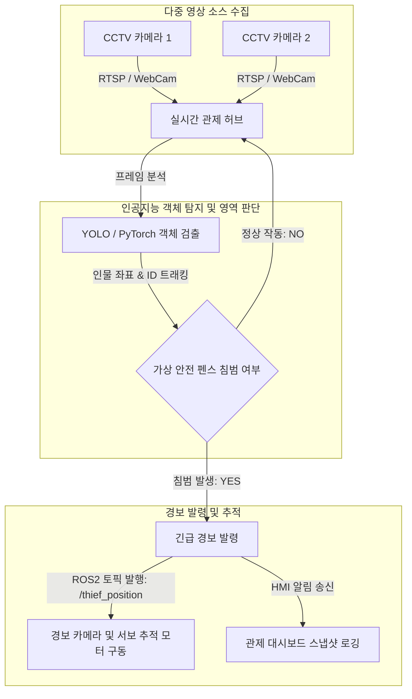

# 🚨 박물관 보안 관제 및 침입자 탐지 시스템 (박살팀)

다중 CCTV 카메라 입력 스트림을 인공지능 기반으로 실시간 모니터링하여 비인가 구역에 진입하거나 전시물을 손대려는 침입자(도둑)를 정밀하게 식별하고, 실시간 위치 추적 및 긴급 보안 경보를 전송하는 지능형 관제 시스템입니다.

---

## 🎥 시연 영상 (Demo Video)
- [시연 영상 보기 (Google Drive)](https://drive.google.com/file/d/your-find-thief-video-id/view?usp=sharing)
  > [!TIP]
  > 대용량 파일 업로드 제한으로 인해 고화질 시연 영상은 Google Drive 공유 링크를 통해 제공됩니다.

---

## 📊 1. 시스템 설계 및 플로우 차트 (System Design & Flow Chart)

### 시스템 개요
본 시스템은 다중 CCTV 카메라 스트림(RTSP 또는 웹캠)을 실시간 수집하는 **영상 분석부**, YOLO 기반 객체 탐지와 인물 ID 트래킹(ByteTrack)을 거쳐 가상 펜스 경계 이탈 여부를 판정하는 **판단부**, 그리고 침범 이벤트가 검출될 시 경보 발령 및 ROS2 네트워크를 통해 카메라 회전 제어용 하드웨어에 침입자 위치 좌표(`/thief_position`)를 송신하는 **제어부**로 설계되었습니다.

### 시스템 흐름도 (Mermaid)



---

## 💻 2. 운영체제 환경 (Operating System Environment)

- **OS**: Ubuntu 22.04 LTS
- **Middleware**: ROS2 Humble (Robot Operating System)
- **개발 환경**: Python 3.10

---

## 🛠️ 3. 사용한 장비 목록 (Hardware Equipment List)

- **영상 입력 장치**: IP CCTV 카메라 (RTSP 지원) 및 관제용 USB 웹캠 2대
- **경보 및 추적 하드웨어**: 팬틸트(Pan-Tilt) 서보 모터 모듈 (ROS2 제어 인터페이스 내장)
- **보안 에지 서버 (Edge PC)**: NVIDIA Jetson Orin Nano 혹은 GPU 탑재 로컬 PC

---

## 📦 4. 의존성 (Dependencies)

시스템 실행을 위해 필요한 주요 라이브러리 및 하드웨어 연동 드라이버는 `requirements.txt`에 명시되어 있습니다.

- **딥러닝 & 컴퓨터 비전**: `torch>=2.0.0`, `torchvision`, `opencv-python`, `ultralytics` (YOLO)
- **다중 객체 추적 (Multi-Object Tracking)**: `lap`, `ByteTrack` 패키지
- **기타 유틸리티**: `pyyaml`, `numpy`
- **ROS2 패키지**: `rclpy`, `sensor_msgs`, `std_msgs`

> [!NOTE]
> 자세한 내용은 [requirements.txt](requirements.txt) 파일을 참고해 주세요.

---

## 🚀 5. 간단한 실행 순서 (Execution Sequence & Launch Script)

보안 관제 프로그램 및 모터 추적 노드를 구동하는 명령어 구성입니다.

### Step 1. ROS2 환경 소싱 및 서보 모터 제어 노드 실행
침입자 감지 시 카메라를 침입자 방향으로 회전시키는 추적 하드웨어 노드를 실행합니다.
```bash
# ROS2 환경 소싱
source /opt/ros/humble/setup.bash

# 팬틸트 추적 노드 실행
ros2 run museum_security_tracker tracker_node
```

### Step 2. 다중 CCTV 탐지 및 안전 펜스 모니터링 메인 스크립트 실행
지정된 카메라 입력(RTSP 주소 또는 웹캠 인덱스)을 전달하여 침입자 검출 파이프라인을 켭니다.
```bash
source /opt/ros/humble/setup.bash

# 침입 감지 메인 프로그램 실행 (가상 안전 영역 설정 및 YOLO 탐지 구동)
python3 main_detector.py --source0 rtsp://your_cctv_ip_1 --source1 rtsp://your_cctv_ip_2
```

### Step 3. HMI 알림 및 Firebase 대시보드 모니터링
경보 상황을 실시간으로 확인하기 위해 모니터링 웹 콘솔을 실행하여 확인합니다.
```bash
python3 run_dashboard.py
```
*침입이 감지되면 자동으로 경보음이 울리며 `/thief_position` ROS2 토픽이 발행되고, 대시보드에 캡처 화면과 침입 시간이 기록됩니다.*
