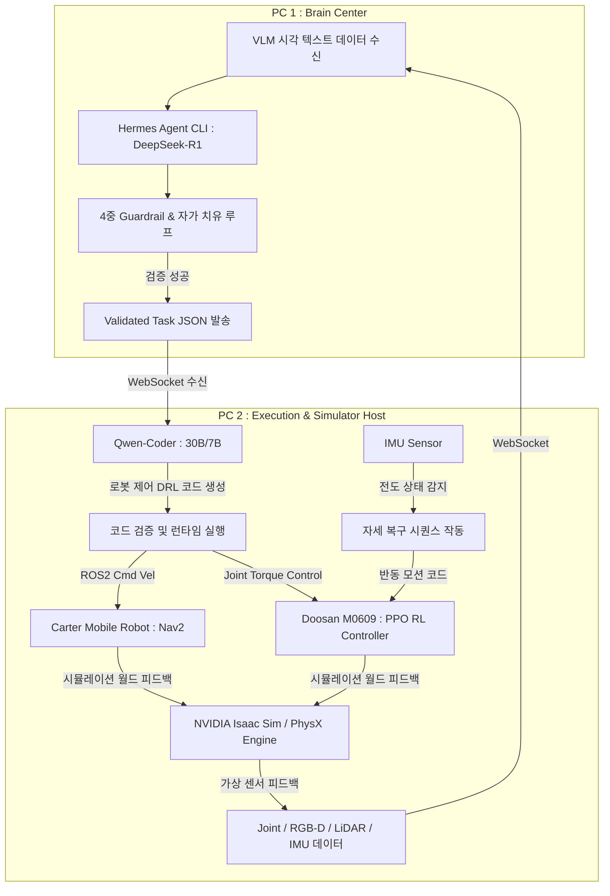

# 🪐 춘식이 화성가즈아 - 디지털 트윈 기반 로봇 자동화 시뮬레이션 시스템
> **분산형 VLA 기반 로봇 에이전트 시스템: Florence-2 / DeepSeek-R1 / Qwen-Coder / Isaac Sim**

---

## 🎥 시연 영상 (Demo Video)
<video src="https://github.com/soli-robot/portfolio/raw/main/projects/Isaac/isaac_video_compressed.mp4" controls="controls" width="100%"></video>

- [원본 고화질 시연 영상 보기/다운로드 (Google Drive)](https://drive.google.com/file/d/11oT84DWzO0lYnFYUb4PZSTShq1LefNRS/view?usp=drive_link)

---

## 📖 1. 프로젝트 개요 (Introduction)
화성 우주 탐사 및 물류 시나리오를 바탕으로 구축된 **가상 시뮬레이션 월드**에서 자율주행 모바일 로봇(Carter)과 고정식 로봇 팔(Doosan M0609)을 통합 제어하는 디지털 트윈 기반 자동화 시스템입니다. 

기존의 단순 하드코딩식 자동화의 한계를 극복하기 위해, **소형 VLM인 Florence-2**의 실시간 비전 센서 정보 분석 기술, **DeepSeek-R1 추론 백엔드** 및 **Qwen-Coder**의 분산 제어를 융합했습니다. 이를 통해 로봇 에이전트가 "화성 기지의 특정 자재를 수거하여 이송하라"는 모호한 자연어 명령을 받으면, 표준 작업 지시 JSON 패킷 및 실행 코드 시퀀스로 자동 변환하고 실시간 구동하는 3-PC 분산형 VLA(Vision-Language-Action) 파이프라인을 구축했습니다.

특히 험지 주행 중 발생할 수 있는 모바일 로봇의 **전도(넘어짐) 현상**을 극복하기 위해, **가상 IMU 센서 피드백**, **PyTorch 강화학습(PPO) 기립 제어**, **LiDAR 스캔 데이터 - OpenCV 템플릿 매칭 기반 전역 위치 자가 복구** 모듈을 하나로 융합한 강인한 자율 생존 주행 시스템을 탑재했습니다.

---

## 👥 2. 팀 구성 및 역할 (Team R&R)
| 이름 | 역할 | 담당 업무 및 상세 |
| :---: | :---: | :--- |
| **홍성욱** | 조장 | **시스템 통합 및 맵 제작** - 3-PC 분산 처리를 위한 실시간 웹소켓(WebSocket) 통신 아키텍처 설계 - World Creator 및 생성형 AI 텍스처를 활용한 고정밀 가상 화성 맵 환경 메쉬 및 렌더링 구축 |
| **양준호** | 조원 | **상황인지 및 작업 지시 LLM** - DeepSeek-R1/Nous Hermes Agent 기반의 추론 브레인 센터 노드 구축 - Doosan M0609 로봇 팔의 Pick & Place 강화학습(PPO) 모델 학습 및 가상 맵 제작 협력 |
| **송종진** | 조원 | **코더 LLM 연동 및 ROS2 Nav2 자율주행, 전도 감지/기립 및 OpenCV 라이다 위치 매칭 자가 복구 모듈 개발 (주요 기여)** - Qwen-Coder 모델 연동을 통한 DRL 코드 자동 생성 및 스케줄링 흐름도 설계 - ROS2 Navigation2 기반 Carter 모바일 로봇의 자율주행 및 파라미터 최적화 (`update_min_d`, `xy_goal_tolerance` 튜닝) - IMU 센서 데이터를 연동하여 모바일 로봇의 전도를 감지하고, 탑재된 로봇 팔의 관절 제어를 통해 물리적으로 다시 일어서는 기립 시퀀스 구현 - 기립 후 흐트러진 자이로 오차 복구를 위한 2D LiDAR Scan과 전역 맵 간의 OpenCV 템플릿 매칭(`matchTemplate`) 위치 주입 노드 구현 |
| **최찬우** | 조원 | **강화학습 고도화** - Isaac Gym 환경에서 Doosan M0609 로봇 팔의 Suction Grasp 및 6자유도 이송 강화학습 PPO 모델 학습 고도화 |
| **안교진** | 조원 | **비전 AI 및 4족 로봇 제어** - Florence-2 VLM을 활용한 시각 센서 정보 분석 및 Dense Caption 텍스트 생성 모듈 설계 - 험지 극복을 위한 4족 보행 로봇(Spot)의 강화학습 에이전트 설계 |

---

## 🎯 3. 주요 기능 (Key Features)
* **VLM 기반 환경 캡처 분석:** 가상 4방향 카메라에서 이미지를 캡처하여 Florence-2 모델로 객체 탐지(`<OD>`) 및 세부 설명(`<CAPTION>`)을 생성해 실시간 맵 상황을 텍스트화합니다.
* **Brain Center의 자가 치유(Self-Correction) 계획:** DeepSeek-R1이 캡처된 텍스트 컨텍스트를 분석하여 작업 명령 패킷을 생성하고, 검증 실패 시 프롬프트에 에러를 누적하여 최대 3회 자가 수정하는 계획 루프를 갖췄습니다.
* **ROS2 Nav2 자율주행:** Carter 모바일 로봇이 불균일한 화성 지형에서 정확히 경로를 계획하고 목표 지점(오차 0.05m 수준)으로 정밀 이동합니다.
* **강화학습 기반 로봇 팔 이송:** Isaac Gym 상에서 학습된 PPO 정책에 따라 로봇 팔이 박스를 정확히 흡착 파지(Suction Grasp)하고 목표 트레이로 Pick & Place를 수행합니다.
* **IMU 센서 연동 자가 전도 복구 (Recovery):** Carter 로봇이 주행 중 굴곡진 지형으로 인해 90도 전도(넘어짐)되었을 때 내장 IMU 센서로 이를 인지하고, 탑재된 로봇 팔 매니퓰레이터의 반동을 제어해 스스로 다시 일어서도록 하는 복구 기능을 수행합니다.

---

## 📌 4. 시스템 핵심 아키텍처 (Architecture & Pipeline)
본 시스템은 물리 엔진, 추론 모델, 제어 로직을 물리적으로 분할한 분산 아키텍처로 구현되었습니다.

---

### 주요 소스 코드 및 모듈 구조 (Modules Detail)

### 1. `code_llm_module8.py` (비동기 VLA 오케스트레이터)
이 스크립트는 PC2(시뮬레이터 호스트) 상에서 동작하며, 비전 데이터 송신과 작업 명령 수신을 제어하는 오케스트레이터입니다.
* **Florence-2 시각 추론 (`run_florence2` / `analyze_images_with_florence`)**: `microsoft/Florence-2-base` 모델을 로드하여 가상 4방향 카메라 이미지의 객체 검출(`<OD>`) 및 장면 설명(`<CAPTION>`)을 생성합니다. 컨텍스트 폭주를 막기 위한 텍스트 요약 알고리즘이 내장되어 있습니다.
* **비전 데이터 송신부 (`send_vision_data_to_pc1`)**: 정기적으로 이미지를 캡처 및 분석하여 객체 개수와 장면 설명을 JSON 규격 패킷으로 만들어 WebSocket을 통해 PC1 Brain Center로 송신합니다.
* **명령 수신 및 스키마 계획 (`command_handler` / `run_task_pipeline`)**: PC1 브레인에서 수신한 JSON 작업 명세서를 코더 LLM(`qwen3-coder:30b`)을 호출하여 베이스 로봇 스킬 리스트(`"move"`, `"pick"`, `"put"`)로 구성된 실행 계획 배열로 매핑합니다.
* **비동기 스킬 실행 (`execute_robot_skill`)**:
  * `"move"`: `move_controller_1.navigate_to`를 비동기 스레드 풀에서 호출하여 자율주행을 수행합니다.
  * `"pick"` / `"put"`: `pick_module` 내의 강화학습 정책 컨트롤러(`IsaacPolicyController`) 인스턴스를 통해 Doosan 로봇 팔의 조인트를 구동하고 완료할 때까지 비동기 대기(`await asyncio.sleep`)합니다.

### 2. `move_controller_1.py` (자율주행 및 넘어짐 자가 복구 엔진)
이 스크립트는 ROS2 Navigation2와 PyTorch RL 정책 모션, 그리고 OpenCV 이미지 매칭을 활용해 모바일 로봇의 자율주행과 자가 전도 복구를 전담합니다.
* **이동 시 로봇 팔 접기 (`folded_pose`)**: 주행 중에 로봇 팔이 펼쳐져 있으면 무게중심 불균형으로 인해 전도 위험이 높아지므로, 주행 명령 시작 시 로봇 팔 관절을 `FOLDED_POSE` (`[3.14, -1.57, 1.57, 0.0, 1.57, 0.0]`)로 접어두어 무게중심을 낮추는 안전 장치가 구현되어 있습니다.
* **IMU 기반 넘어짐 감지 (`imu_callback`)**: 섀시의 IMU 센서 데이터를 모니터링하여 중력 벡터 `proj_gravity[2]`가 `-0.5` 이상으로 꺾이면(정상 기립 시 `-1.0`) 즉시 넘어짐을 인지하고 진행 중인 Nav2 목표를 강제 취소합니다.
* **RL 기립 제어 루프 (`rl_control_loop`)**:
  1. **0점 정렬**: 관절을 `HOMING_POSE`로 신속 정렬 후 기립 강화학습 모델(`move.pt`)을 로드합니다.
  2. **RL 기립 모션 가동**: IMU 중력 벡터, 현재 조인트 각도/속도, 이전 동작을 관측값(Observation) 삼아 PyTorch 모델의 정책 출력을 `/joint_commands`로 실시간 전송합니다. 로봇 팔을 힘차게 뻗쳐 바닥을 밀어내는 반동으로 물리 기립을 수행합니다.
  3. **기립 판정**: 중력 벡터가 `-0.95` 미만으로 유지되면 기립 성공으로 판정하고 복구 상태로 진입합니다.
* **OpenCV LiDAR 맵 매칭 기반 전역 위치 추정 자가 복구 (`perform_opencv_matching` / `inject_self_pose`)**:
  * 넘어지는 충격과 로봇 팔 반동 과정에서 바퀴가 헛돌아 AMCL 자이로 오차가 극대화되고 위치 추정을 완전히 잃어버리게 됩니다.
  * 이를 해결하기 위해, 기립 직후 로봇의 LiDAR 스캔 데이터를 2D 로컬 이미지로 변환하고 전역 맵 이미지(`warehouse.png`)에 대해 5도 간격으로 360도 회전 템플릿 매칭(`cv2.matchTemplate`)을 수행합니다.
  * 가장 높은 일치도를 보이는 글로벌 좌표(X, Y, Yaw)를 확정하고, `/initialpose` 토픽으로 주입하여 AMCL 자이로 오차를 강제 보정 후 기존 목표지로 주행을 자동 재개(`resume_navigation_directly`)합니다.

### 3. `extension.py` (Isaac Sim Extension 연동)
NVIDIA Omniverse Isaac Sim의 GUI와 백그라운드 런타임을 브릿징하는 Python 스크립트입니다. 가상 월드 내의 물리 이벤트 및 렌더링 상태를 모니터링하고 제어 스레드와의 동기화를 수행합니다.

### 4. `pick_module.py`
Doosan M0609 매니퓰레이터의 Joint State 피드백과 Tensor API를 연동하여 가상 스테이지 상에 존재하는 객체의 정밀한 Suction Grasp 및 6자유도 이송 강화학습(PPO) 물리 구동 정책을 실행하는 모듈입니다.

---

## 🛠️ 5. 기술 스택 (Tech Stack)
* **OS & Middleware:** Ubuntu 22.04 LTS, ROS2 Humble
* **Simulator:** NVIDIA Omniverse Isaac Sim 2023.1.1, Isaac Gym (PhysX Engine 기반)
* **AI & VLA Models:** Microsoft Florence-2-base, DeepSeek-R1 (Nous Hermes 2.5), Qwen-2.5-Coder (7B/30B)
* **Control & Navigation:** ROS2 Navigation2 (Nav2), PyTorch (PPO Core), Joint Command API (Python)
* **Vision & Processing:** OpenCV (cv2), numpy, Pillow (PIL), PyTorch JIT (`torch.jit`)
* **Communication:** WebSockets (Async Real-time JSON Bridge)

---

## 💡 6. 트러블슈팅 및 주요 성과 (Troubleshooting & Achievements)

### 1. ROS2 Nav2 기반 Carter 모바일 로봇 주행 오차 개선 (송종진 주도)
* **문제점**: 험하고 굴곡진 화성 지형 특성상 Carter 모바일 로봇 주행 시 가상 라이다 스캔 데이터와 기존 2D Costmap 간의 불일치가 빈번하여 목표 정밀 도달에 실패하거나 Y축으로 탈조하는 현상이 발생했습니다.
* **해결 방안**: 
  - Nav2 로컬 플래너 파라미터를 수정하여 `update_min_d`를 기존 `0.25`에서 `0.05`로 크게 단축시켜 위치 갱신 빈도를 고도화했습니다.
  - 최종 목적지 도달 허용 오차인 `xy_goal_tolerance` 값을 `0.25`에서 `0.05`로 정밀 튜닝하여 좁은 도달 범위 내에서도 로봇이 정확히 감속 및 타겟 스팟에 안착하도록 주행 안전성을 대폭 확보했습니다.

### 2. 가상 IMU 센서 연동 360도 전도 대비 기립 모션 및 자가 복구 (송종진 주도)
* **문제점**: 화성의 불균일한 사면 경사 및 장애물 메쉬 충돌로 인해 모바일 로봇이 90도 각도로 전도(전복)되는 상황이 실시간 테스트 시 90% 이상의 확률로 빈번히 발생하여 물류 이송 작업이 도중에 완전히 마비되었습니다.
* **해결 방안**: 
  - 로봇의 섀시 IMU 센서를 ROS2 토픽으로 받아 실시간 모니터링하여 중력 가속도 임계치를 감지하는 안전 관제 루틴을 개설했습니다.
  - 전복 인지 즉시 주행을 멈추고 관절 0점 정렬 후 PyTorch JIT 기립 모델(`move.pt`)의 강화학습 거동을 수행하여 Doosan 로봇 팔의 물리적 반동과 밀치기(Push-up) 모션으로 카터를 다시 정상 기립 상태로 강제 복구했습니다.

### 3. 기립 후 자이로 유실 오차 극복을 위한 OpenCV 라이다 맵 매칭 (송종진 주도)
* **문제점**: 로봇이 전복되었다가 일어서는 강한 물리적 충격과 바퀴의 슬립 현상으로 인해 AMCL 기반 위치 추정이 완전히 무너졌습니다. 로봇이 현재 어디 서 있는지 모르는 오차 상태가 되어 자율주행 복구가 불가능했습니다.
* **해결 방안**: 
  - 기립 완료 판정이 나는 순간, 로봇의 360도 라이다 스캔 데이터를 받아 OpenCV 2D 바이너리 이미지로 드로잉했습니다.
  - 전역 월드 맵의 이진 맵 이미지(`warehouse.png`)를 0도부터 360도까지 5도 간격으로 회전시킨 템플릿 이미지들과 `cv2.matchTemplate` 연산을 병렬 처리하여 가장 높은 정밀도(Correlation Value)를 가지는 전역 X, Y 및 회전각(Yaw)을 검출했습니다.
  - 복구된 좌표를 `/initialpose`로 즉시 퍼블리시하여 AMCL 위치 추정을 자동 복원시켰고, 끊김 없는 자율 복구 주행(`resume_navigation_directly`)을 구현하는 데 성공했습니다.

---

## 🚀 7. 실행 방법 및 환경 구축 (How to Run)
- 본 프로젝트는 다중 PC 환경(분산 노드)에서 구동되도록 설계되었습니다.
- Omniverse Isaac Sim 및 Nav2 런타임 환경 등 상세한 실행 환경 및 명령어는 내부 위키를 참조해 주세요.
