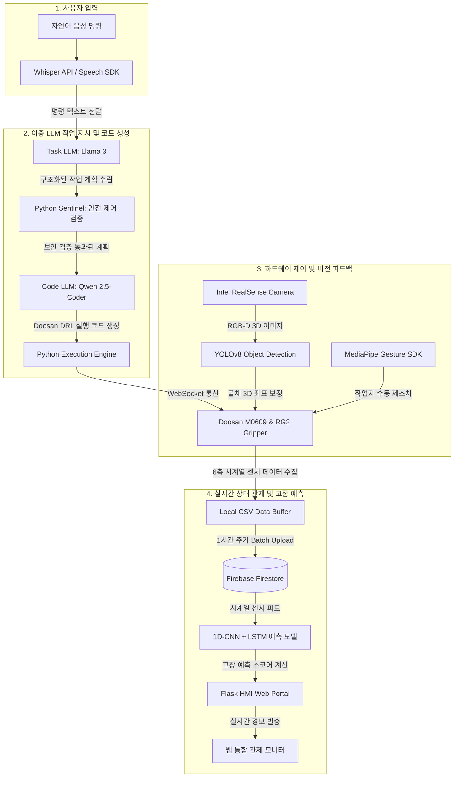

# 🤖 춘식아 해줘 - Semantic AI 기반 자율 협동 로봇 어시스턴트

단순 반복형 공장 자동화를 넘어, 인간의 애매모호한 자연어 음성 지시를 실시간으로 분석하고 판단하여 실제 두산 로봇(Doosan M0609)을 자율 제어하는 **차세대 AI 협동 로봇 어시스턴트 시스템**입니다.

---

## 🎥 시연 영상 (Demo Video)
- [시연 영상 보기 (Google Drive)](https://drive.google.com/file/d/your-lama-video-id/view?usp=sharing)
  > [!TIP]
  > 대용량 파일 업로드 제한으로 인해 고화질 시연 영상은 Google Drive 공유 링크를 통해 제공됩니다.

---

## 📊 1. 시스템 설계 및 플로우 차트 (System Design & Flow Chart)

### 시스템 개요
본 시스템은 사용자 자연어 명령을 해독하는 **Task LLM(Llama 3)**과 실시간 로봇 제어 코드를 생성하는 **Code LLM(Qwen 2.5-Coder)**을 물리적/논리적으로 분할한 **3단계 분업 에이전트 아키텍처**를 가지고 있습니다.
또한 생성된 코드의 위험성을 미리 검증하는 **파수꾼(Python Sentinel)** 로직, RealSense 카메라 기반의 **비전 좌표 보정**, 비상 조작용 **MediaPipe 제스처 수동 제어**, 그리고 **1D-CNN + LSTM 기반 AI 예지보전 대시보드**가 유기적으로 연계되어 작동합니다.

### 시스템 흐름도 (Mermaid)



---

## 💻 2. 운영체제 환경 (Operating System Environment)

시스템의 부하를 지연(Latency) 없이 처리하기 위해 이중 PC 환경에서 다중 운영체제 및 ROS2를 구축하였습니다.

- **Task LLM & 작업 관리 PC**: 
  - **OS**: Ubuntu 24.04 LTS
  - **Middleware**: ROS2 Jazzy Jalisco
- **Code LLM & 로봇 제어 PC**:
  - **OS**: Ubuntu 22.04 LTS (Doosan 로봇 드라이버 연동 호환성 확보)
  - **Middleware**: ROS2 Humble
- **개발 환경 파이썬 버전**: Python 3.10

---

## 🛠️ 3. 사용한 장비 목록 (Hardware Equipment List)

- **협동 로봇 (Manipulator)**: Doosan Robotics M0609 Robot Arm
- **그리퍼 (Gripper)**: OnRobot RG2 Gripper
- **3D 비전 카메라 (RGB-D Camera)**: Intel RealSense D435i Camera
- **개발용 워크스테이션 / 에지 PC (Workstation)**:
  - CPU: Intel Core i7 13th Gen 이상
  - GPU: NVIDIA GeForce RTX 5060 / 4060 PC (Local LLM 및 딥러닝 고속 연산용)

---

## 📦 4. 의존성 (Dependencies)

프로젝트 루트의 `requirements.txt`에 명시되어 있으며, 다음 라이브러리를 필요로 합니다.

- **AI 및 자연어 처리**: `ollama`, `faster-whisper`, `SpeechRecognition`, `pyaudio`
- **비전 및 머신러닝**: `torch>=2.0.0`, `opencv-python`, `mediapipe`, `ultralytics` (YOLOv8)
- **데이터 분석 및 백엔드**: `flask>=3.0.0`, `flask-cors>=4.0.0`, `streamlit`, `numpy>=1.24.0`, `pandas>=2.0.0`, `scipy`
- **네트워크 및 클라우드**: `websocket-client`, `firebase-admin`
- **로봇 제어 패키지 (ROS2 환경 필요)**:
  - `rclpy`, `ament_index_python`
  - Doosan 로봇 API: `DR_init`, `DSR_ROBOT2`, `dsr_msgs2`, `dsr_control2`

> [!NOTE]
> 자세한 내용은 [requirements.txt](requirements.txt) 파일을 참고해 주세요.

---

## 🚀 5. 간단한 실행 순서 (Execution Sequence & Launch Script)

동작 안정성을 위해 아래의 순서대로 구동하는 것을 강력하게 권장합니다.

### Step 1. AI 예지보전 백엔드 및 관제 HMI 서버 실행
로봇 센서 관제와 이상 감지를 수행하는 Flask 서버를 먼저 실행합니다.
```bash
# HMI 디렉토리로 이동 후 Flask 실행
cd src/Admin_Web_Page
python3 app.py
```
*브라우저에서 `http://127.0.0.1:5000`으로 접속하여 모니터링 페이지를 확인할 수 있습니다.*

### Step 2. 백엔드 작업 지시 UI (Streamlit) 구동
자연어 음성 및 텍스트 명령 입력을 지원하는 유저 인터페이스를 구동합니다.
```bash
cd src/Task_LLM
streamlit run TaskLLM_Node.py
```

### Step 3. 메인 웹소켓 서버 및 코드 제어 노드 구동
로봇 제어 PC(Code LLM 실행 PC)에서 메인 웹소켓 컨트롤 서버를 실행합니다.
```bash
cd src/Code_LLM
python3 CodeLLM_fine_Node.py
```

### Step 4. 자연어 작업 명령 전달
Streamlit UI 혹은 마이크 음성 입력을 통해 자연어 명령(예: *"노란색 수건 집어서 바구니에 담아줘"*)을 입력하면 시스템이 다음 과정을 자동으로 수행합니다.
1. `Task_LLM`이 작업 계획서 구성
2. 비전 카메라 좌표 보정 실행
3. `Code_LLM`이 DRL 제어 코드를 실시간 생성
4. `Sentinel` 검증 및 승인 후 `CodeLLM_fine_Node`를 통해 로봇에 명령 전달
