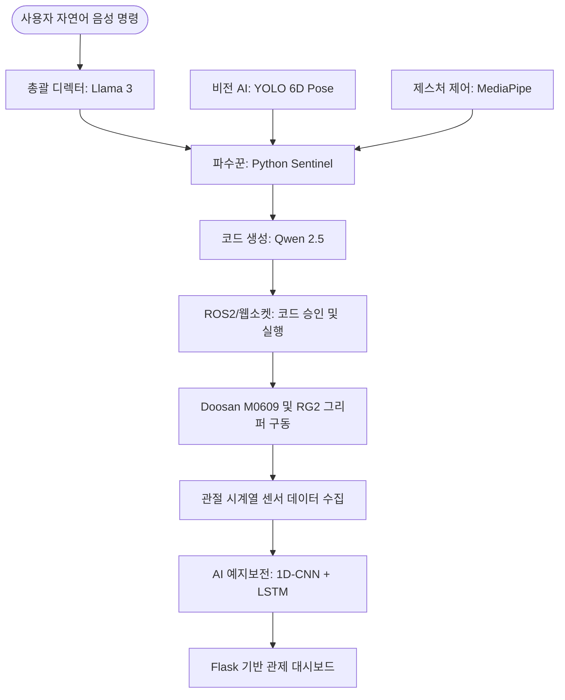

# 🤖 춘식아 해줘 - Semantic AI 기반 자율 협동 로봇 어시스턴트
> **자율 궤적 플래닝을 위한 VLA 기반의 협동 로봇 제어: Semantic AI 에이전트 분업 아키텍처**

---

## 🎥 시연 영상 (Demo Video)
- [시연 영상 보기](https://github.com/soli-robot/portfolio/releases/download/v1.0.0-videos/lama_video.mp4)

---

## 📖 1. 프로젝트 개요 (Introduction)
단순 반복 작업을 하드코딩으로 자동화하는 수준을 넘어, 사람의 모호한 자연어 명령을 스스로 분석하고 기획하여 작업을 수행하는 **Local AI 파트너**입니다. 산업 환경 변화 시 별도의 재프로그래밍 없이 즉각적으로 대응할 수 있도록, **'작업 지시 AI(Llama 3)'**와 **'코드 생성 AI(Qwen 2.5-Coder)'**를 물리적/논리적으로 분리한 3단계 분업 아키텍처를 도입했습니다.

여기에 더해 RealSense 기반 비전 인식, MediaPipe 제스처 수동 제어, 그리고 1D-CNN + LSTM 기반의 AI 예지보전 모니터링 시스템을 하나의 통합된 웹소켓 및 Flask 런타임으로 결합하여 시스템의 유연성과 안전성을 극대화했습니다.

---

## 👥 2. 팀 구성 및 역할 (Team R&R)
| 이름 | 역할 | 담당 업무 |
| :---: | :---: | :--- |
| **홍성욱** | 조장 | 프로젝트 총괄, Firebase DB 연동, AI 예지 보전 파이프라인 구축(1D-CNN+LSTM) |
| **양준호** | 조원 | 작업 지시 LLM(Macro/Micro Planner) 아키텍처 설계, 파이썬 안전 제어(파수꾼) 로직 구현 |
| **송종진** | 조원 | 코더 LLM(Qwen 2.5-Coder) 연동 및 최적화, 로봇 제어 API 템플릿 및 모듈 설계 |
| **최찬우** | 조원 | 코더 LLM 최적화, 프롬프트 경량화 및 코드 생성 파이프라인 실시간성 개선 |
| **안교진** | 조원 | 비전 AI(YOLO26-seg v5) 학습, 6D Pose 추출 모듈 개발, 제스처 컨트롤 모듈 구현 |

---

## 🎯 3. 주요 기능 (Key Features)
* **자연어 기반 작업 자동 생성:** 사용자의 자연어 명령을 분석해 Doosan M0609용 Python 제어 코드로 자동 변환하고, 승인된 코드만 하드웨어에 전달합니다.
* **비전 기반 좌표 추출:** RealSense와 YOLO를 통해 객체 위치를 탐지하고, 캘리브레이션 행렬을 이용해 로봇 기준 3D 좌표계로 정밀하게 변환합니다.
* **제스처 기반 수동 백업 제어:** 손가락 개수(0~5개)를 인식하여 추종, 표면 방향 추적, Pick & Place, 자세 미세 조정, 홈 포지션 복귀 등의 제어를 수행합니다.
* **AI 예지보전 통합 관제:** 로봇의 6개 관절 시계열 센서 데이터를 바탕으로 고장을 예측하고, Modbus TCP 기반 대시보드로 현장 인프라를 실시간 모니터링합니다.

---

## 📌 4. 시스템 핵심 아키텍처 (Architecture & Pipeline)
본 시스템은 단일 LLM의 연산 부하 문제를 해결하고 물리적 인프라와의 연동성을 높이기 위해 전체 구조를 유기적으로 연결했습니다.

---

## 🛠️ 5. 기술 스택 (Tech Stack)
* **운영체제 및 환경:** Ubuntu 24.04 LTS, ROS2 (Jazzy / Humble 호환), Doosan Robotics DRL, Python 3.10
* **하드웨어:** Doosan M0609 Robot Arm, OnRobot RG2 Gripper, Intel RealSense Camera, RTX 5060/4060 PC
* **AI & 비전 모델:** Ollama (Llama 3, Qwen 2.5-Coder), Faster-Whisper, YOLO26n-seg v5, MediaPipe, PyTorch
* **네트워크 및 데이터베이스:** WebSockets (JSON 실시간 통신), Modbus TCP, Firebase (Firestore), CSV 로깅
* **웹 프론트엔드 및 백엔드:** Streamlit (작업 지시 UI), Flask (관제 HMI)

---

## 💡 6. 트러블슈팅 및 주요 성과 (Troubleshooting & Achievements)
* **코더 LLM 실시간성(Latency) 대폭 개선:** 1만 자 이상의 한글 프롬프트를 영문 기반 2,020자로 경량화하고 핵심 로직만 생성하도록 역할을 축소하여 코드 생성 시간을 60초에서 10초(약 83% 감소)로 획기적으로 단축했습니다.
* **YOLO 좌표 오차 및 충돌 위험(Z-Offset) 해결:** 정적 스캔 방식(10초 누적)으로 좌표 정밀도를 확보하고, JSON 데이터 송신 시 안전 마진(`z_offset`)을 명시하여 완벽한 'ㄷ'자 무빙(충돌 방지)을 구현했습니다.
* **비전 인식 실패 대비 제스처 백업 구현:** 카메라가 물체를 인식하지 못하는 예외 상황을 대비해, 사용자의 손가락 벡터가 가리키는 방향으로 로봇이 시선을 돌리는 록온(Lock-on) 수동 제어 모듈을 결합했습니다.
* **AI 예지 보전 DB 비용 및 과부하 최적화:** 초당 단위 센서 데이터를 로컬 버퍼에 누적 후 1시간 주기로 압축하여 Firebase에 일괄 전송(Batch Upload)함으로써 실시간성과 API 비용 절감을 동시에 달성했습니다.

---

## 🚀 7. 실행 방법 및 환경 구축 (How to Run)
🚀 시스템 환경 구축 및 실행 가이드 (How to Run)
본 프로젝트를 로컬 에지 PC 환경에서 에러 없이 구동하기 위한 통합 가이드라인입니다.

### 3개의 폴더를 각기 다른 컴퓨터로 옮겨야 됩니다. 

1. 사전 요구 사항 및 시스템 세팅 (Prerequisites)
OS: Ubuntu 24.04 LTS(작업관리 ai),  Ubuntu 22.04(코더 ai)

ROS2: Jazzy Jalisco(작업관리 ai), Humble(코더 ai)

Audio: 마이크 입력을 위한 시스템 오디오 라이브러리 필요

1) 시스템 패키지 및 Ollama 플랫폼 설치
터미널을 열고 다음 명령어를 실행하여 필수 시스템 라이브러리와 로컬 AI 구동 환경을 구축합니다.

Bash
sudo apt-get update
sudo apt-get install -y python3-venv python3-pip portaudio19-dev

# Ollama 플랫폼 설치
curl -fsSL https://ollama.com/install.sh | sh

# 작업 지시용 Llama 3 (8B) 모델 다운로드 - Task_LLM 컴퓨터만 실행합니다.
ollama pull llama3:latest

# 코더 제작용 Qwen (7B) 모델 다운로드 - Code_LLM 컴퓨터만 실행합니다.
ollama pull qwen2.5-coder:7b

2) 작업 폴더 및 가상환경 생성
OS 전역 패키지와의 충돌을 막기 위해 가상환경(venv)을 생성하고 활성화합니다.

Bash
mkdir -p ~/doosan_agent && cd ~/doosan_agent
python3 -m venv myenv
source myenv/bin/activate
3) ROS2 시스템 패키지 인식
터미널을 열 때마다 ROS2 환경을 인식시켜야 합니다.

Bash
source /opt/ros/jazzy/setup.bash
2. 의존성 패키지 설치 (Dependencies)
가상환경이 활성화된 상태((myenv))에서 프로젝트 핵심 라이브러리들을 일괄 설치합니다.

1) 통합 설치 명령어 (pip install)

Bash
pip install flask>=3.0.0 flask-cors>=4.0.0 torch>=2.0.0 numpy>=1.24.0 pandas>=2.0.0 \
            streamlit ollama websocket-client faster-whisper SpeechRecognition \
            pyaudio firebase-admin rclpy opencv-python scipy pyrealsense2 \
            ultralytics mediapipe ament_index_python pick_and_place_text
2) Doosan 로봇 제어용 필수 패키지
추가로 Doosan M0609 로봇 제어를 위해 다음 구성 요소가 프로젝트 환경에 맞게 별도 설치되어 있어야 합니다.

DR_init

DSR_ROBOT2

dsr_msgs2

dsr_control2

3. 주요 모듈 아키텍처 (Modules)
3-1. CodeLLM_fine_Node.py
전체 시스템의 메인 웹소켓 서버(포트 8888) 역할을 합니다. 외부 컨트롤러와 연결된 뒤, 전달된 요청을 분기 처리합니다.

[Bring-1]: 스캔 모듈을 안전하게 호출하여 객체 좌표 수집

[Bring-2]: 제스처 제어 모듈을 호출하여 손 제스처 기반 제어 수행

generate: qwen2.5-coder:7b 모델을 사용해 로봇 작업 코드 생성. 생성된 코드는 후처리되어 perform_task() 본문으로 정리되며, 로컬 파일 저장 및 Firebase Firestore에 로그 기록.

execute: 승인된 코드를 실제로 실행

3-2. integrated_scan_module.py
비전 기반 객체 스캔과 3D 좌표 추출을 담당합니다.

RealSense 카메라 초기화

YOLO 모델로 객체 탐지

깊이값으로 3D 좌표 계산

캘리브레이션 행렬(T_gripper2camera.npy)을 적용해 로봇 기준 좌표계로 변환

안정적으로 모인 좌표 클러스터링 후 scan_result_base_coord.json에 최종 저장

3-3. gesture_control_module.py
손 제스처 기반 로봇 제어를 담당합니다. (실시간 수동 보정, 객체 중심 이동, 홈 복귀, Pick & Place)

RealSense와 YOLO로 객체 인식 후, MediaPipe로 손가락 개수를 판별합니다.

손가락 개수에 따른 동작 분기:

5개: 손 추종

4개: 표면 방향 추적 / 레이캐스팅 기반 제어

3개: 일정 횟수 이상 감지 시 Pick & Place 수행

2개: 홈 포지션 복귀

1개: 4번 joint로 자세 미세 조정

0개: 그리퍼 닫기

timeout=30.0초 동안 손이 감지되지 않으면 자동 종료됩니다.

4. 통합 실행 순서 (Execution Steps)
아래 순서대로 시스템을 구동하는 것을 권장합니다.

4-1. 사전 준비 체크
모델 파일(towel_yolo26n_seg_v5_best.pt)과 캘리브레이션 파일(T_gripper2camera.npy) 경로 확인.

Doosan 로봇, RealSense 카메라, OnRobot RG2 그리퍼 및 네트워크 연결 상태 확인.

로봇 툴 세팅과 TCP 설정은 Tool Weight, GripperDA_v1 기준 적용 확인.

4-2. AI 예지보전 백엔드 및 관제 대시보드 실행
프로젝트 루트 디렉토리로 이동하여 백엔드 서버를 켭니다.

Bash
cd C:\rokey\Jarvis_LLM_integration
python src/AI_/app.py
HMI 진입: 브라우저에서 http://127.0.0.1:5000으로 접속하여 실시간 통합 관제 확인.

4-3. 메인 웹소켓 서버 및 UI 구동
새 터미널에서 가상환경 및 ROS2 활성화 후, 메인 서버와 관제 UI를 구동합니다.

Bash
# 백그라운드 스트림릿 UI 구동
streamlit run TaskLLM_Node.py

# 메인 웹소켓 서버 실행 (8888 포트)
python3 CodeLLM_fine_Node.py
4-4. 외부 컨트롤러 통신 명령 (Action & Prompt)
메인 서버 구동 후 외부 컨트롤러에서 JSON 형태로 다음 명령을 전달하여 작업을 지시합니다.

스캔 작업 실행: action = "generate", prompt = "[Bring-1]"

제스처 제어 실행: action = "generate", prompt = "[Bring-2]"

코드 생성 실행: action = "generate", prompt = "사용자 작업 설명" (LLM 코딩 수행)

승인 코드 실행: action = "execute", code = "<승인된 Python 코드>" (temp_robot_run.py로 임시 저장 후 로봇 동작)

5. 스크립트 단독 실행 참고
다른 모듈이나 셸에서 기능별 단독 테스트가 필요할 경우 아래 함수를 직접 호출할 수 있습니다. (단, ROS2 및 로봇 제어 환경이 정상적으로 준비된 상태여야 합니다.)

Python
from integrated_scan_module import run_scan_module
from gesture_control_module import run_gesture_module

# 스캔 및 좌표 추출 수행
run_scan_module()

# 제스처 기반 제어 수행
run_gesture_module()

