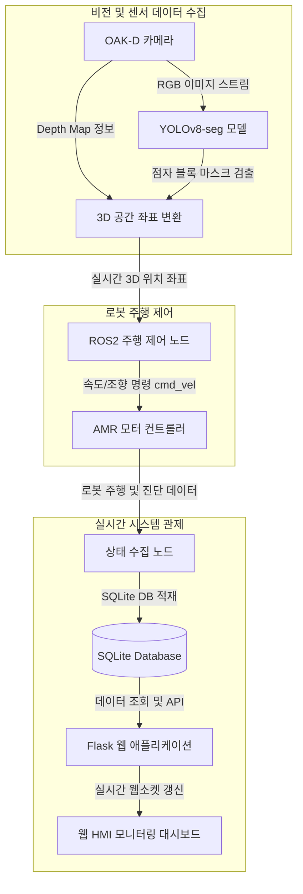

# 🦯 시각 장애인 안내용 자율주행 AMR 및 시스템 관제

OAK-D 스테레오 카메라와 YOLOv8-seg 인공지능 모델을 융합하여 실시간으로 보도의 점자 블록을 인식하고, 이를 기반으로 시각 장애인을 안전하게 안내할 수 있도록 자율주행 모바일 로봇(AMR)의 경로를 계획하며, 전체 시스템 상태를 실시간 모니터링하는 플랫폼입니다.

## 🎯 핵심 기능
1. **실시간 점자 블록 탐지 (YOLOv8-seg & OAK-D)**: 
   - OAK-D 깊이 카메라의 RGB 스트림을 분석하여 점자 블록의 위치와 방향을 인공지능 세그멘테이션으로 실시간 추출합니다.
   - 픽셀 좌표 정보를 카메라 뎁스 정보와 합성하여 3D 공간 상의 물리적인 좌표로 변환합니다.
2. **ROS2 기반 AMR 자율주행 제어**:
   - 추출된 점자 블록의 경로 정보를 ROS2 토픽으로 전송하여 로봇이 지정된 가이드라인을 이탈하지 않도록 모터 제어 명령을 자동 생성합니다.
3. **웹 기반 시스템 모니터 대시보드 (Flask HMI)**:
   - 로봇의 현재 위치, 모터 상태, 배터리 잔량, 카메라 연결 상태 등 진단 정보를 실시간 수집하여 SQLite 데이터베이스에 기록합니다.
   - Flask 백엔드 서버와 실시간 웹 통신을 통해 관리자가 브라우저에서 로봇의 주행 상태 및 이벤트 알림(경고)을 직관적으로 확인할 수 있도록 화면을 제공합니다.

## 📊 시스템 흐름도 (Flowchart)

## 🛠️ 기술 스택
- **운영체제 및 미들웨어**: Ubuntu 22.04 LTS, ROS2 Humble
- **하드웨어 및 디바이스**: Autonomous Mobile Robot (AMR) 플랫폼, OAK-D Pro Stereo Camera
- **인공지능 & 컴퓨터 비전**: YOLOv8-segmentation, OpenCV, DepthAI SDK
- **데이터베이스 및 백엔드**: Python 3.10, Flask, SQLite3, HTML/CSS/JS (HMI Dashboard)
