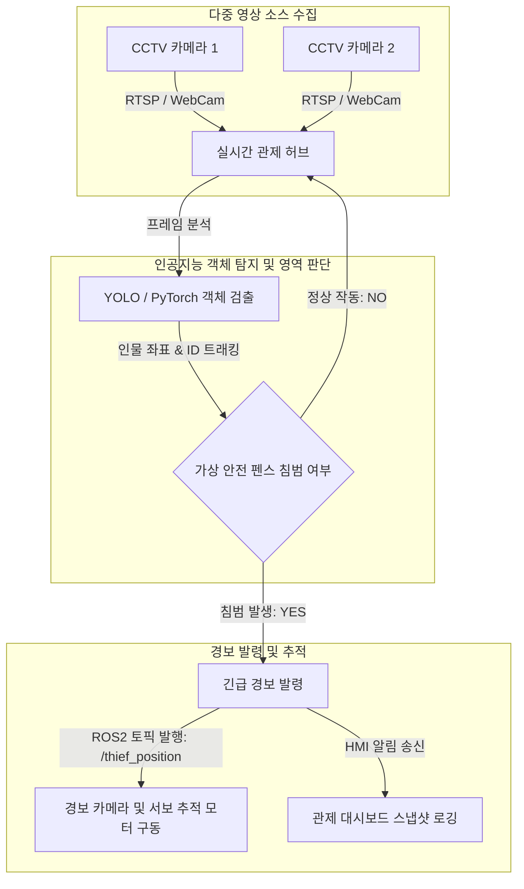

# 🚨 박물관 보안 관제 및 침입자 탐지 시스템 (박살팀)

다중 CCTV 카메라 입력 스트림을 인공지능 기반으로 실시간 모니터링하여 비인가 구역에 진입하거나 전시물을 손대려는 침입자(도둑)를 정밀하게 식별하고, 실시간 위치 추적 및 긴급 보안 경보를 전송하는 지능형 관제 시스템입니다.

## 🎯 핵심 기능
1. **실시간 객체 및 행동 인식**:
   - 다중 카메라 영상 소스로부터 실시간으로 사람(Person) 및 특정 물체(전시물)를 고속으로 검출합니다.
   - 전시물 주변의 가상 펜스(Safe Zone) 영역을 설정하고 객체의 바운딩 박스 간의 충돌 검사를 수행해 비인가 접근을 실시간으로 감지합니다.
2. **ROS2 기반 위치 정보 퍼블리시**:
   - 감지된 침입자의 좌표 및 추적(Tracking) ID 정보를 ROS2 네트워크를 통해 전송하여, 현장의 이동식 CCTV 카메라나 안내 로봇이 침입자를 실시간으로 조준 및 추적할 수 있도록 지원합니다.
3. **지능형 관제 모니터링**:
   - 위험 수준별(주의/경고/위험) 경보 상황을 시스템에 즉시 브로드캐스트하여 중앙 관제실 HMI 및 연계 서버에 경보 이벤트와 당시 캡처를 기록합니다.

## 📊 시스템 흐름도 (Flowchart)

## 🛠️ 기술 스택
- **미들웨어 및 운영체제**: Ubuntu 22.04 LTS, ROS2 Humble
- **개발 언어**: Python 3.10
- **AI & 컴퓨터 비전**: PyTorch, Custom Object Detection Model, OpenCV, ByteTrack (Multi-object tracking)
- **통신 및 프로토콜**: ROS2 Pub/Sub, Firebase Realtime Database
