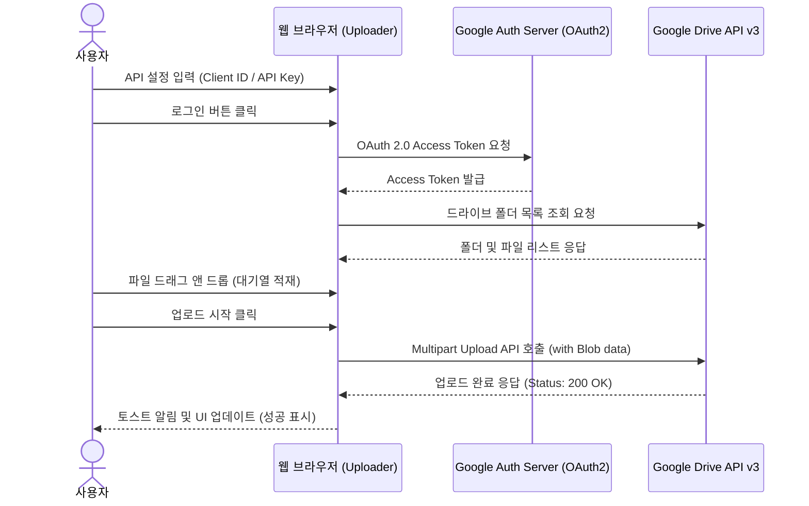

# 📂 Google Drive Uploader

웹 브라우저를 기반으로 로컬 파일을 구글 드라이브에 안전하고 손쉽게 일괄 업로드하고 관리할 수 있도록 지원하는 프론트엔드 유틸리티입니다.

## ✨ 주요 기능
- **Drag & Drop 다중 파일 업로드**: 마우스 드래그 동작 또는 파일 탐색기 선택을 지원하며 다량의 파일을 큐에 적재하여 일괄 전송할 수 있습니다.
- **업로드 실시간 상태 모니터링**: 개별 파일별로 업로드 진척 상황(%)과 결과를 프로그레스 바를 통해 시각적으로 실시간 모니터링할 수 있습니다.
- **클라이언트 사이드 OAuth 2.0 처리**: Google Identity Services(GIS) API를 사용해 안전하고 신속한 브라우저 자체 토큰 발급 및 파수꾼 역할을 수행합니다.
- **드라이브 디렉토리 브라우저**: 연동된 드라이브의 폴더 구조를 탐색하여 특정 하위 폴더 경로를 생성하거나 업로드 목적지로 지정할 수 있습니다.
- **유리 테마(Glassmorphism) 기반 UI**: 어두운 공상과학(SF) 분위기를 풍기는 다크 모드 레이아웃과 직관적인 아이콘으로 구성되어 사용자 경험을 극대화합니다.

## ⚙️ 시스템 아키텍처 (Flowchart)

