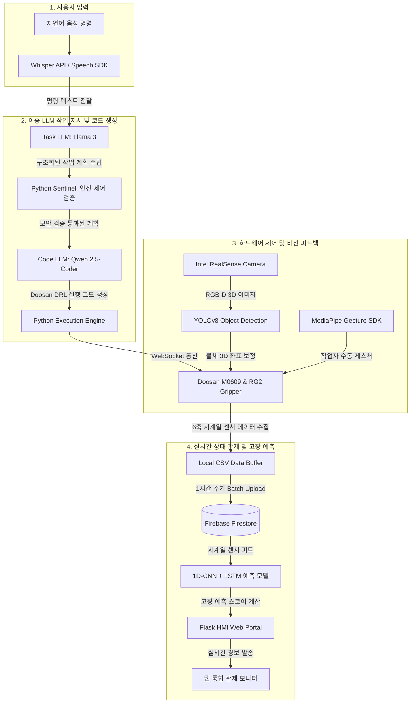

# 🤖 춘식아 해줘 - Semantic AI 기반 자율 협동 로봇 어시스턴트

단순 반복형 공장 자동화를 넘어, 인간의 애매모호한 자연어 음성 지시를 실시간으로 분석하고 판단하여 실제 두산 로봇(Doosan M0609)을 자율 제어하는 **차세대 AI 협동 로봇 어시스턴트 시스템**입니다.

## 🎯 프로젝트 핵심 포인트
1. **이중 LLM 분업 아키텍처 (Task & Code LLM)**:
   - 단일 모델 연산 부하 및 속도 제한을 해결하기 위해 역할을 분할하였습니다.
   - **Task LLM (Llama 3)**: 자연어 명령을 해독하여 로봇 작업 절차(Task Plan)를 설계합니다.
   - **Code LLM (Qwen 2.5-Coder)**: 실시간으로 로봇 제어 명령어(Python Code)를 정밀 생성합니다.
2. **안전성 확보를 위한 파수꾼(Sentinel) 로직**:
   - 생성된 코드가 하드웨어 손상이나 안전 구역 이탈을 일으키지 않도록 사전에 위험 요소를 검출하여 승인된 코드만 실행합니다.
3. **비전 및 제스처 보조 제어**:
   - **Intel RealSense & YOLO**: 물체의 6D Pose 및 3D 좌표를 추출하고 캘리브레이션 행렬을 통해 로봇 좌표계로 정밀 변환합니다.
   - **MediaPipe Gesture**: 비전 인식 불가 등 예외 상황 발생 시, 작업자의 손가락 제스처를 인식해 로봇을 수동으로 조작하는 백업 시스템을 제공합니다.
4. **1D-CNN + LSTM 기반 AI 예지보전**:
   - 로봇의 6개 관절에서 발생하는 시계열 전류/진동 데이터를 수집하고, 딥러닝 기반 고장 예측 알고리즘을 통해 이상 상태를 실시간 탐지하여 대시보드(Flask HMI)에 경보를 전송합니다.

## 📊 시스템 연동 및 제어 흐름도 (Flowchart)

## 🛠️ 기술 스택 (Tech Stack)
- **OS & Middleware**: Ubuntu 24.04 & 22.04 LTS, ROS2 (Jazzy / Humble 호환)
- **Robotics**: Doosan Robotics DRL (M0609 Arm), OnRobot RG2 Gripper, Modbus TCP
- **AI Models**: Ollama Local Run (Llama 3 8B, Qwen 2.5-Coder 7B), Faster-Whisper, YOLOv8-seg, MediaPipe, PyTorch (1D-CNN + LSTM)
- **Web Backend & Database**: Flask, Streamlit UI, WebSocket, Firebase Firestore, SQLite
